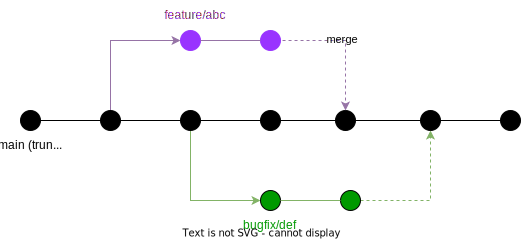

# Contributing

This document lays down the basic general guidelines for contributing to the project.

In addition to this document, each package may have its own `CONTRIBUTING.md` file that contains package-specific guidelines:

- [API Client Contributing Doc](./libs/frontend/api-client/CONTRIBUTING.md)

## Git Workflow

  

We use a [Scaled Trunk-Based Development](https://trunkbaseddevelopment.com/), an approach that encourages developer(s) to continuously committing changes to a single central repository known as the "trunk" (`main` branch).

## Committing Code

Generally code commits should be small improvements and can be integrated quickly.

When working on larger features that can take days to complete it is expected that the developer(s) work in a `feature` branch and continuously merge the `main` branch with their own feature branch to keep them synchronised.

**Important:**
Code commits must use [Conventional Commits](https://www.conventionalcommits.org/en/v1.0.0/#summary) format.

The commit type can include the [following](https://www.freecodecamp.org/news/how-to-write-better-git-commit-messages/#:~:text=Conventional%20Commits,-Now%20that%20we&text=fix%20%E2%80%93%20a%20bug%20fix%20has,bug%20nor%20adds%20a%20feature):

- `feat` – a new feature is introduced with the changes
- `fix` – bug fix has occurred
- `chore` – changes that do not relate to a fix or feature and don't modify src or test files (for example updating dependencies)
- `refactor` – refactored code that neither fixes a bug nor adds a feature
- `docs` – updates to documentation such as a the README or other markdown files
- `style` – changes that do not affect the meaning of the code, likely related to code formatting such as white-space, missing semi-colons, and so on.
- `test` – including new or correcting previous tests
- `perf` – performance improvements
- `ci` – continuous integration related
- `build` – changes that affect the build system or external dependencies
- `revert` – reverts a previous commit

## Pull Requests

- Once the feature or change is completed it should be submitted as a PR to the `main` branch.
- The PR should be reviewed by at least one [CODEOWNER](#codeowners) before being merged.
- Once the PR is approved it can be merged by the author*.

**NOTE:**

*The author of the PR can merge it if they have the required permissions, otherwise the PR must be merged by a CODEOWNER. Also, as a general pratice, it is recommended to rebase the PR branch with the `main` branch and **ALWAYS** resolve conflict (if any) before merging it.

## Codeowners

A CODEOWNERS file is a configuration file in a Git repository that specifies which individuals or teams are responsible for reviewing and approving changes to specific files or directories in the codebase.

The file is used to automate the code review process and ensure that the appropriate people are notified when changes are made to critical parts of the code, which makes it especially useful when working on a monorepo based project.

To see who owns a specific file or directory, you check out our [CODEOWNERS](CODEOWNERS) file.
