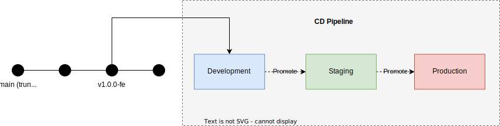
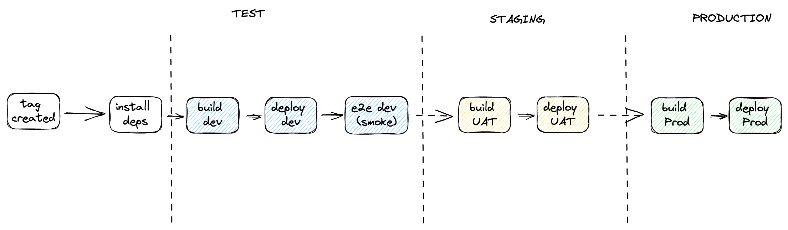

# Deployment

## Tag-based Deployment

  

  

Tag-based deployment is a software deployment strategy in which a specific version of an application is identified and marked with a tag in the version control system.

This tag acts as a reference point for deployment, allowing teams to easily deploy a specific version of the application to various environments, such as development, staging, or production.

In a monorepo with multiple packages like this, we will use a different tag identifier for each package to allow for independent deployment of each package.

## Feature Flags

Using a trunk based approach also means that the trunk will serve as the single source of truth for the entire codebase and always contain the most up-to-date version of the code, which means the trunk will always be on a releasable state.

Therefore, to control the release and/or allow for gradual roll-out of new features we also adopt the use of [Feature Flags](https://www.atlassian.com/continuous-delivery/principles/feature-flags).
