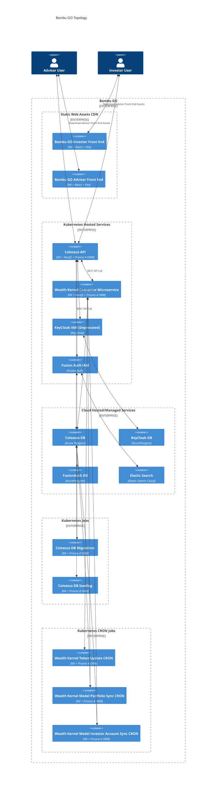

# Colossus Topology

```mermaid
C4Context
    title Bambu GO Topology

    Person(customerA, "Advisor User")
    Person(customerB, "Investor User")

    Enterprise_Boundary(b0, "Bambu GO") {
        BiRel(customerA, c0, "Download Advisor Front End Assets")
        BiRel(customerA, c1, "")
        BiRel(customerB, c2, "Download Advisor Front End Assets")
        BiRel(customerB, c1, "")

        Enterprise_Boundary(b1, "Static Web Assets CDN") {
            Container(c2, "Bambu GO Investor Front End", "NX + React + Vite")
            Container(c0, "Bambu GO Advisor Front End", "NX  + React + Vite")
        }

        BiRel(c1, c3, "REST API Call")
        BiRel(c1, c7, "REST API Call")
        BiRel(c1, c8, "REST API Call")

        Enterprise_Boundary(b2, "Kubernetes Hosted Services") {
            Container(c1, "Colossus API", "NX + NestJS + Prisma 4 ORM")
            Container(c3, "Wealth Kernel Connector Microservice", "NX + NestJS + Prisma 4 ORM")
            Container(c7, "KeyCloak IAM (Deprecated)", "KeyCloak")
            Container(c8, "Fusion Auth IAM", "Fusion Auth")
        }

        Enterprise_Boundary(b3, "Cloud Hosted/Managed Services") {
            Container(c4, "Colossus DB", "Azure Postgres")
            Container(c5, "KeyCloak DB", "AzurePostgres")
            Container(c6, "FusionAuth DB", "AzurePostgres")
            Container(c9, "Elastic Search", "Elastic Search Cloud")
        }

        BiRel(c10, c4, "")
        BiRel(c11, c4, "")

        Enterprise_Boundary(b4, "Kubernetes Jobs") {
            Container(c10, "Colossus DB Migrations", "NX + Prisma 4 ORM")
            Container(c11, "Colossus DB Seeding", "NX + Prisma 4 ORM")
        }

        BiRel(c12, c3, "")
        BiRel(c13, c3, "")
        BiRel(c13, c4, "")
        BiRel(c14, c3, "")
        BiRel(c14, c4, "")

        Enterprise_Boundary(b5, "Kubernetes CRON Jobs") {
            Container(c12, "Wealth Kernel Token Update CRON", "NX + Prisma 4 ORM")
            Container(c13, "Wealth Kernel Model Portfolio Sync CRON", "NX + Prisma 4 ORM")
            Container(c14, "Wealth Kernel Model Investor Account Sync CRON", "NX + Prisma 4 ORM")
        }

        BiRel(c1, c4, "")
        BiRel(c3, c4, "")
        BiRel(c7, c5, "")
        BiRel(c8, c6, "")
        BiRel(c8, c9, "")
    }

    UpdateLayoutConfig($c4ShapeInRow="3", $c4BoundaryInRow="1")
```
