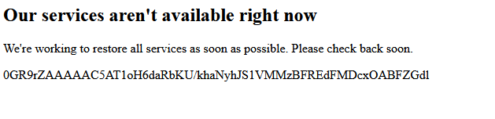
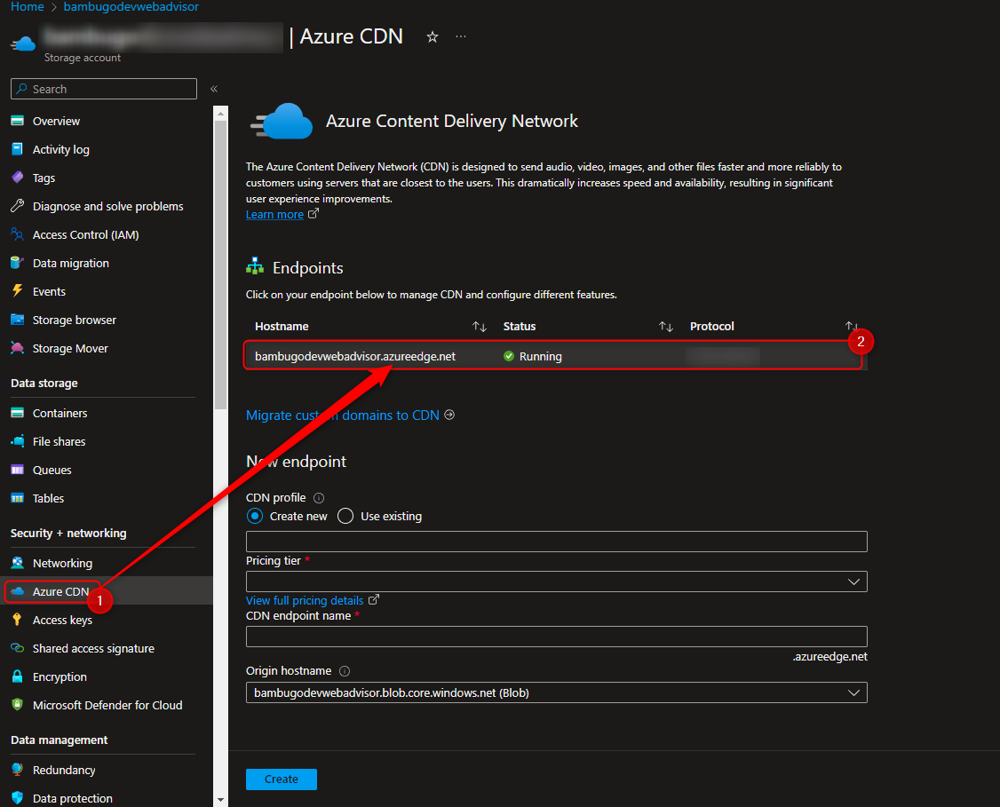
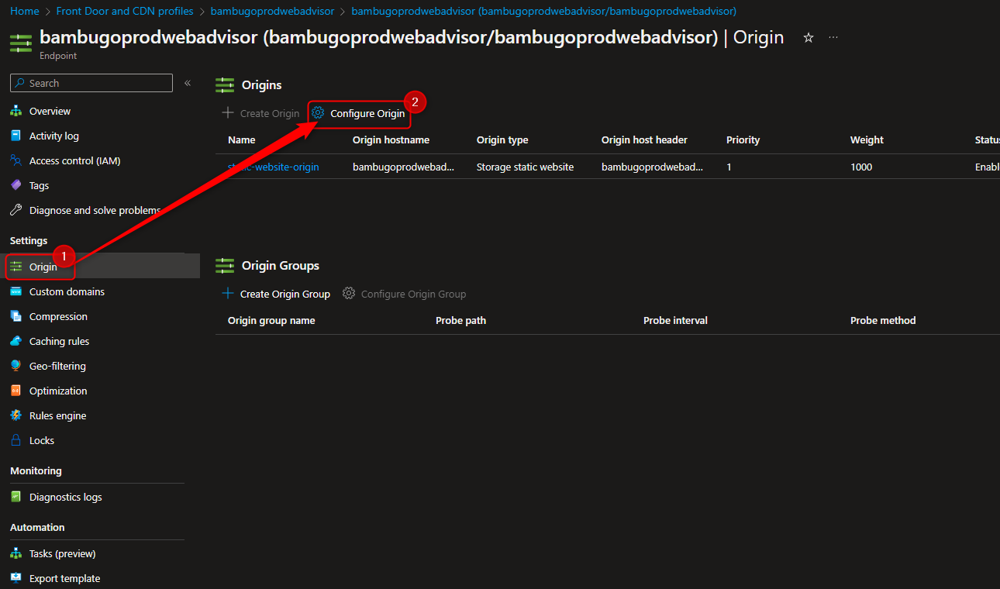
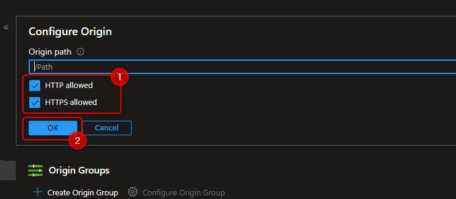
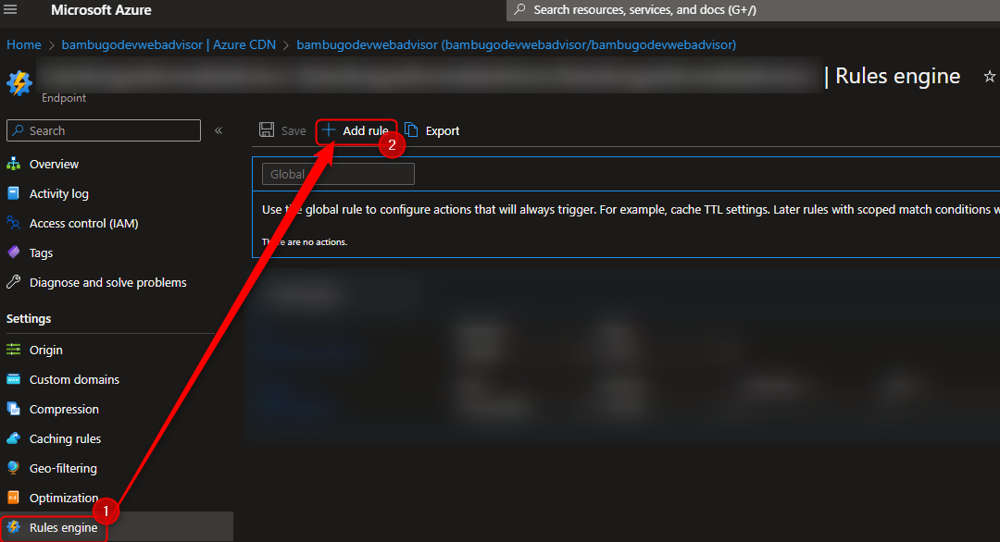

# Azure CDN HTTPS Only Behavior

At the time of this writing. We configured the Azure CDN for the advisor platform to be `HTTPS` only and this caused an
issue where,
when you force the browser to use `HTTP` instead of `HTTPS` it will not redirect to `HTTPS` and will give you an Azure
CDN error message.

See below for illustration.

This is caused by 2 things, namely:

1. The Azure CDN is configured to be `HTTPS` only.
2. The Azure CDN `Rules Engine` is not configured to redirect `HTTP` traffic to `HTTPS`.

# The Azure CDN is configured to be `HTTPS` only

This can be resolved by allowing HTTP traffic to flow through, this can be done by enabling it.
The following steps will guide you through the process.

## Step 1

Go to the relevant CDN profile for the advisor platform. It can be accessed by going to the relevant Azure Storage
account and clicking the CDN button in the left panel.
See the following screenshot for an illustration.

## Step 2

Getting to the screen to enable HTTP traffic to flow through can be done by clicking the `Origin` button in the left
panel and then clicking on the `Configure Origin` button.
See the following screenshot for an illustration.

## Step 3

To enable HTTP traffic to flow through, make sure `HTTP AND HTTP` are selected as allowed protocols.
See the following screenshot for an illustration.

| # | Action                 | Description                                       |
|---|------------------------|---------------------------------------------------|
| 1 | `HTTP & HTTPS Enabled` | Ensure both HTTPS and HTTP checkboxes are ticker. |
| 2 | `Click OK`             | Click OK button to apply settings.                |

After both actions are done, it will take 10-30 minutes settings to take effect on the DNS level.

## The Azure CDN `Rules Engine` is not configured to redirect `HTTP` traffic to `HTTPS`

This is basically to set up a rule to redirect all HTTP traffic to HTTPS. The following steps will guide you through the
process.

## Step 1

Go to the relevant CDN profile for the advisor platform. It can be accessed by going to the relevant Azure Storage
account and clicking the CDN button in the left panel.
See the following screenshot for an illustration.

## Step 2

Go to the Rules Engine and click on the `Add Rule` button. See the following screenshot for an illustration.

## Step 3

Step 5 onwards in the following guide will show you how it is done.

[https://docs.microsoft.com/en-us/azure/cdn/cdn-rules-engine-reference-features#redirect](https://docs.microsoft.com/en-us/azure/cdn/cdn-rules-engine-reference-features#redirect)

# Appendix A - Azure Static Website Links

At the time of this writing (2023-05-22), here are the list of relevant Azure Storage Accounts where these settings are
relevant.

| # | Azure Storage Account Name | Azure Storage Account Link                                                                                         | Environment | Purpose          |
|---|----------------------------|--------------------------------------------------------------------------------------------------------------------|-------------|------------------|
| 1 | `bambugodevwebadvisor`     | [https://bambugodevwebadvisor.z13.web.core.windows.net/](https://bambugodevwebadvisor.z13.web.core.windows.net/)   | Development | Advisor Platform |
| 2 | `bambugoprodwebadvisor`    | [https://bambugoprodwebadvisor.z13.web.core.windows.net/](https://bambugoprodwebadvisor.z13.web.core.windows.net/) | Production  | Advisor Platform |

## Notes:

- We are only putting in the advisor platform for now. The `investor` accesses things via a reverse proxy which uses a
  different mechanism.

