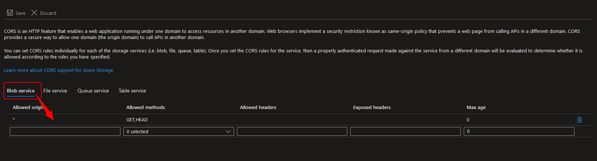
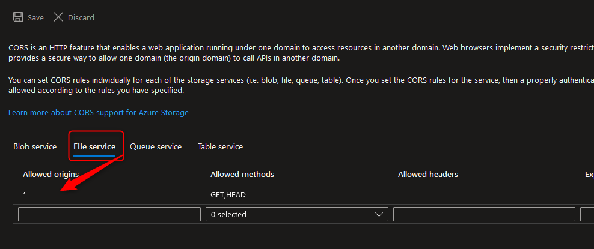
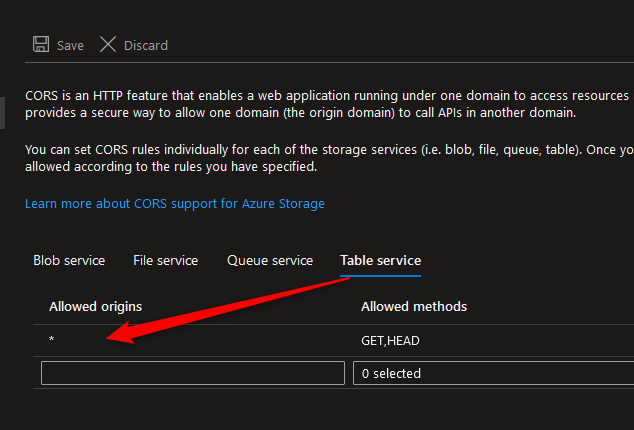
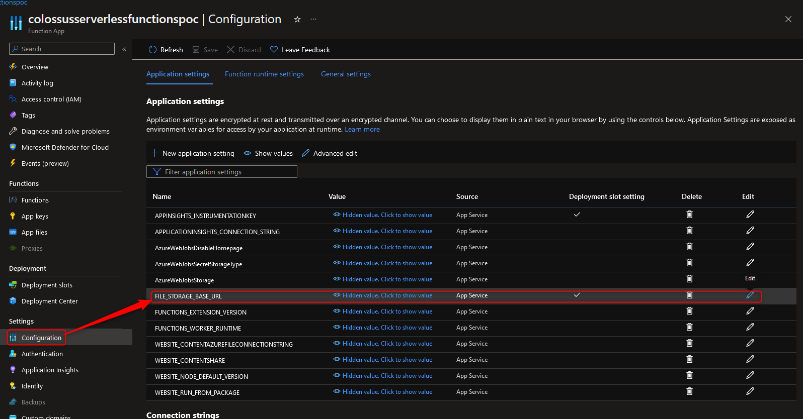

# Azure Functions - Investor Reverse Proxy

This document will document how to configure the reverse proxy that uses Azure Functions.

## Prerequisites

1. Create an Azure Functions App.
   - Code Base: https://bitbucket.org/bambudeveloper/colossus-azure-functions/src/master/
2. Create Azure Storage Account.
   - Setup Static Web Site.
   - Create CDN bound to storage account.

## Deploying Investor Single Page Web App

`WIP`

## Configuring CORS for Azure Storage

CORS needs to be configured since the URL on the browser will be different, it may/will cause CORS issues.

The settings can be seen in the following screenshots.

## Configuring Azure Functions Reverse Proxy Destination URL

This is configured by editing the value configuration/environment variable value `FILE_STORAGE_BASE_URL` under the `Configuration` section of the Azure Function App.
See following screenshot for illustration on where it is.

The value should be in the following format, for instance, if the Azure Storage Static Web Application container URL is http://investor-dev.bambu.co/,
put in the value `http://investor-dev.bambu.co`. 
Notice that the trailing `/` is not included in the setting. This is very important.
Under no circumstances should a trailing `/` be included in the setting.
