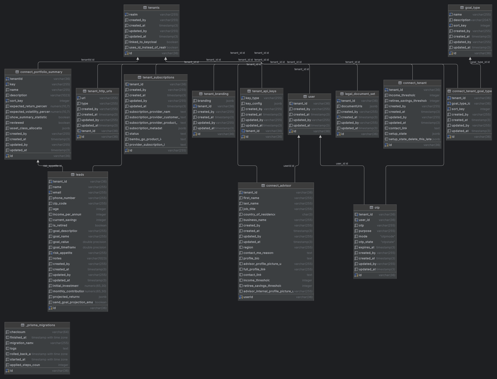

# Colossus Database Documentation

The purpose of this document is to provide a high-level overview of the database schema and the relationships between
the tables.

## Table Definitions

This section will cover the tables in the database and their relationships.

### Common Columns

The following columns are common to all tables in the database.

1. `created_by`
   - White created the record.
2. `created_at`
   - When the record was created.
3. `updated_by`
   - Who last updated the record.
4. `updated_at`
   - When the record was last updated.

### DB TABLE - `_prisma_migrations`

This is a system table used for data migrations done by the `Prisma ORM` used by Colossus.

`DO NOT MODIFY THIS TABLE` under pain of death, for `Benjamin is in actuality a reincarnation of Jack The Ripper` and
his methods would be most unpleasant.

### DB TABLE - `tenants`

This is the database table that stores the `tenants` in the colossus platform. The tenants for the `connect` phase of
the platform are essentially advisors.
Later down the road when `transact` comes into play, this table will be used to list the organizations/companies that
use colossus.

#### Columns

1. `id`
  - Primary key
  - The unique identifier for the tenant.
  - Uses UUID to generate unique id.
2. `realm`
  - The realm that the tenant belongs to.
  - This is derived from the `connect advisor's email for now`. New mechanism will be devised when we move to
    the `transact` phase.
3. `linked_to_keycloak`
  - Boolean flag to indicate if the tenant is linked to a keycloak realm.
  - If this is not linked, it means that user registration failed.
4. `uses_id_instead_of_realm`
  - This is a boolean flag to indicate if the tenant uses the `id` instead of the `realm` for identification.
  - This is meant for legacy accounts, and will be phased out in the future.
  - (backend devloper note): Our use of FusionAuth has it only recognize the tenant id. There may be legacy code in Colossus depending on `realm` or `realmName`.

### DB TABLE - `connect_portfolio_summary`

This table stores the `portfolio summary` for the `connect` phase of the platform.
Transact does not have specific instruments and such so the table is simple by design.
Once we are in the `transact` phase, this table will be extended.

#### Columns

1. `id`
   - Primary key
   - The unique identifier for the portfolio summary.
   - Uses UUID to generate unique id.
2. `tenantId`
   - Foreign key to the `tenants` table.
   - The tenant that the portfolio summary belongs to.
   - Column name is not consistent with the rest of the database due to developer error. Will be rectified down the road.
3. `key`
   - The key for the portfolio summary. This is used as a unique identifier for the portfolio summary in the UI level. We did not want to expose the `id` to the user as this is a `SaaS` platform.
4. `name`
   - The user readable name of the portfolio summary.
5. `description`
   - The user readable description of the portfolio summary.
6. `sort_key`
   - The sort key for the portfolio summary.
   - This is used to sort the portfolio summaries in the UI.
7. `expected_return_percent`
   - The expected return percentage for the portfolio summary.
8. `expected_volatility_percent`
   - The expected volatility percentage for the portfolio summary.
9. `show_summary_statistics`
   - Boolean flag to indicate if the summary statistics should be shown in the UI.
10. `reviewed`
    - Boolean flag to indicate if the portfolio summary has been reviewed by the advisor.
11. `asset_class_allocation`
    - The asset class allocation for the portfolio summary.
    - JSON column to keep the number of columns flexible during development time.

### DB TABLE - `tenant_http_urls`

This table stores the URL used for the tenant's investor portal.

#### Columns

1. `id`
   - Primary key
   - The unique identifier for the tenant http url.
   - Uses UUID to generate unique id.
2. `tenant_id`
   - Foreign key to the `tenants` table.
3. `url`
   - The URL for the tenant's investor portal.
4. `type`
   - Denotes type of URL. Currently only `TENANT` is used. Future uses will be determined later. 

### DB TABLE - `tenant_subscriptions`

This table stores the subscription information for the tenant. For the connect phase, this would be the `Advisor's Connect Subscription`.

#### Columns

1. `id`
   - Primary key
   - The unique identifier for the tenant subscription.
   - Uses UUID to generate unique id.
2. `tenant_id`
   - Foreign key to the `tenants` table.
3. `subscription_provider_name`
   - The name of the subscription provider tool.
   - Currently, there will only be `STRIPE`. Later on, there will be more.
4. `subscription_provider_customer_id`
   - The customer id for the tenant in the subscription provider tool. (i.e. the subscription provider tool's way of identifying this tenant)
   - The initial value will be the `PENDING`.
     - The `PENDING` value is used to denote that the tenant has not been registered with the subscription provider.
5. `subscription_provider_product_id`
   - The ID of the product in the subscription provider.
   - For `STRIPE`, price is used instead of product due to the way `STRIPE` works.
6. `subscription_metadata`
   - The metadata for the subscription.
   - This is a JSON column to keep the number of columns flexible during development time.
7. `status`
   - The status of the subscription.
   - The initial value will be `PENDING`.
     - The `PENDING` value is used to denote that the tenant's subscription has not been registered with the subscription provider.
   - Possible values are `[PENDING, ACTIVE, INACTIVE]`.
     - `ACTIVE` means that the subscription is active.
     - `INACTIVE` means that the subscription is inactive.
8. `bambu_go_product_id`
   - Column to map the `Bambu GO` product id to the subscription.
   - At this time, only `CONNECT` is there.
9. `provider_subscription_id`
   - The subscription id in the subscription provider.

### DB TABLE - `tenant_branding`

This table stores the branding information for the tenant.

#### Columns

1. `id`
   - Primary key
   - The unique identifier for the tenant branding.
   - Uses UUID to generate unique id.
2. `tenant_id`
   - Foreign key to the `tenants` table.
3. `branding`
   - The branding information for the tenant.
   - This is a JSON column to keep the number of columns flexible during development time.

### DB TABLE - `tenant_api_keys`

This table stores 3rd party API keys for the tenant.
At the time of this writing, only the Bambu API Library keys are stored here.
All keys will be identical for all tenants due to the Bambu API Library being unable to efficiently generate keys for `Bambu GO`'s use case.

#### Columns

1. `id`
   - Primary key
   - The unique identifier for the tenant API key.
   - Uses UUID to generate unique id.
2. `tenant_id`
   - Foreign key to the `tenants` table.
3. `key_type`
   - The type of the key, which 3rd party service this belongs to.
4. `key_config`
   - The configuration for the key.

### DB TABLE - `user`

This table stores the user information for the tenant.
This is to allow the tenant to have multiple users for the `Bambu GO` platform.
For `connect` it will only be one user.
When we are in the `transact` phase, more than 1 user will be the norm.

#### Columns

1. `id`
   - Primary key
   - The unique identifier for the user.
   - This id comes from KeyCloak rather than the database/colossus.
2. `tenant_id`
   - Foreign key to the `tenants` table.

### DB Table - `legal_document_set`

This table stores the legal document set for the tenant.

#### Columns

1. `id`
   - Primary key
   - The unique identifier for the tenant API key.
   - Uses UUID to generate unique id.
2. `tenant_id`
   - Foreign key to the `tenants` table.
3. `documentUrls`
   - The URLs for the legal documents.
   - This is a JSON column to keep the number of columns flexible during development time.
   - This will be renamed down the road for consistency.

### DB Table - `connect_tenant`

This table stores the tenant information for the `connect` product.
This table is earmarked for potential consolidation.

#### Columns

1. `id`
   - Primary key
   - The unique identifier for the tenant API key.
   - Uses UUID to generate unique id.
2. `tenant_id`
   - Foreign key to the `tenants` table.
3. `income_threshold`
   - The income threshold for the tenant's leads.
   - Used to filter leads.
4. `retiree_savings_threshold`
   - The retiree savings threshold for the tenant's leads.
   - Used to filter leads.
5. `contact_link`
   - The contact link for the tenant.
6. `setup_state`
   - The setup state for the tenant.
   - This is used to track the progress of the tenant's setup.

### DB Table - `goal_type`

This table stores the goal types for the tenant.
This is used as a reference table, so the tenant can have their own goal types in the `connect_tenant_goal_type` table.

#### Columns

1. `id`
   - Primary key
   - The unique identifier for the tenant API key.
   - Uses UUID to generate unique id.
2. `name`
   - The name of the goal type.
3. `description`
   - The description of the goal type.
4. `sort_key`
  - The sort key for the goal type.
  - This is used to define the default sorting order in the UI.

### DB Table - `connect_tenant_goal_type`

This table stores the goal types for the tenant.
Data will be based on the `goal_type` table.
This is used to allow the tenant to have their own goal types and sorting order.

#### Columns

1. `id`
   - Primary key
   - The unique identifier for the tenant API key.
   - Uses UUID to generate unique id.
2. `tenant_id`
   - Foreign key to the `tenants` table.
3. `goal_type_id`
   - Foreign key to the `goal_type` table.
4. `sort_key`
  - The sort key for the goal type.
  - This is used to sort the goal types in the UI.

### DB Table - `leads`

This table stores the leads for the tenant. The leads can be converted to `investors` in the `transact` phase.

#### Columns

1. `id`
   - Primary key
   - The unique identifier for the tenant API key.
   - Uses UUID to generate unique id.
2. `tenant_id`
   - Foreign key to the `tenants` table.
3. `name`
    - The name of the lead.
4. `email`
    - The email of the lead.
5. `phone_number`
    - The phone number of the lead.
6. `zip_code`
    - The zip code of the lead.
7. `age`
    - The age of the lead.
8. `income_per_annum`
    - The income per annum of the lead.
9. `current_savings`
    - The current savings of the lead.
10. `is_retired`
    - The retired status of the lead. On Connect at least, it is possible that `income_per_annum` is null if `is_retired` is true, and that `current_savings` is null if `is_retired` is false.
11. `goal_description`
    - The goal description of the lead.
12. `goal_name`
    - The goal name of the lead.
13. `goal_value`
    - The goal value of the lead.
14. `goal_timeframe`
    - The goal timeframe of the lead.
15. `risk_appetite`
    - The risk appetite of the lead.
    - This currently maps to the portfolio summary as each portfolio is mapped to a risk appetite.
16. `notes`
    - The notes of the lead.
    - Not currently in use but will be added on later.
17. `initial_investment`
    - The initial investment of the lead.
18. `monthly_contribution`
    - The monthly contribution of the lead.
    - RSP
19. `projected_returns`
    - The projected returns of the lead.
    - JSON field as the data is quite complex.
20. `send_goal_projection_email`
    - Denotes if an email has been sent to the customer with the investment plan.

### DB Table - `connect_advisor`

This table stores the advisor information for the tenant.
This is linked to both tenant and user.

### Columns

1. `userId`
   - Foreign key to the `user` table.
   - Will be changed to `user_id` for consistency in the future.
2. `tenant_id`
   - Foreign key to the `tenants` table.
3. `first_name`
    - The first name of the advisor.
4. `last_name`
    - The last name of the advisor.
5. `job_title`
    - The job title of the advisor.
6. `country_of_residence`
    - The country of residence of the advisor.
7. `region`
    - The region of the advisor.
8. `business_name`
    - The business name of the advisor.
9. `profile_bio`
    - The profile bio of the advisor.
10. `contact_me_reasons`
    - The contact me reasons of the advisor.
11. `income_threshold`
    - The income threshold of the advisor.
    - Not in use now, will be for later so we can override the connect tenant's default income threshold.
    - Will be used in the `transact` phase.
    - Will be used to filter `leads`.
12. `retiree_savings_threshold`
    - The retiree savings threshold of the advisor.
    - Not in use now, will be for later so we can override the connect tenant's default retiree savings threshold.
    - Will be used in the `transact` phase.
    - Will be used to filter `leads`.
13. `contact_link`
    - The contact link of the advisor.
    - Not in use now, will be for later so we can override the connect tenant's default retiree savings threshold.
    - Will be used in the `transact` phase.
14. `full_profile_link`
    - Provides the full profile link for the advisor that is outside the platform.
15. `advisor_profile_picture_url`
    - The profile picture url of the advisor.
    - To be used for customer facing/investor facing UI.
16. `advisor_internal_profile_picture_url`
    - The profile picture url of the advisor.
    - To be used for internal UI.

### DB Table - `otp`

Table to store OTP numbers. Uses for now are:

1. Verify user account.
2. Reset password.
   1. This is only used internally to reset password, not user facing.

#### Columns

1. `id`
   - Primary key
   - The unique identifier for the OTP.
   - Uses UUID to generate unique id.
2. `user_id`
    - Foreign key to the `user` table.
3. `tenant_id`
    - Foreign key to the `tenants` table.
4. `otp`
   - The OTP number.
5. `purpose`
   - The purpose of the OTP.
   - Possible values are `[INITIAL_EMAIL_VERIFICATION,CHANGE_PASSWORD ]`.
     - `INITIAL_EMAIL_VERIFICATION` - Used to verify the user's email address.
     - `CHANGE_PASSWORD` - Used to reset/change the user's password.
6. `mode`
   - The mode of the OTP.
   - Possible values are `[EMAIL]`.
     - `EMAIL` - Used to send the OTP via email.
   - More modes will be added later.
7. `otp_state`
    - The state of the OTP.
    - Possible values are `[UNUSED,USED,INVALIDATED]`.
      - `UNUSED` - The OTP has not been verified.
      - `USED` - The OTP has been verified.
      - `INVALIDATED` - The OTP has been invalidated.
        - This happens when the same user requests for a new OTP for the same purpose.
8. `expires_at`
    - The expiry date & time of the OTP.
    - It will be 5 minutes from time of issue.
