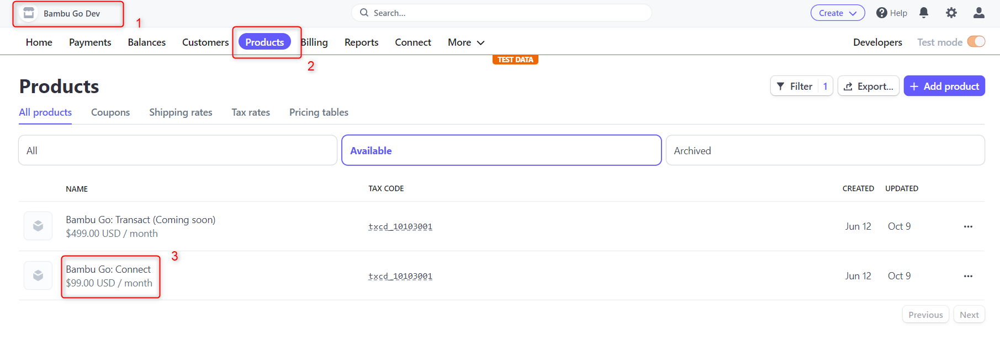
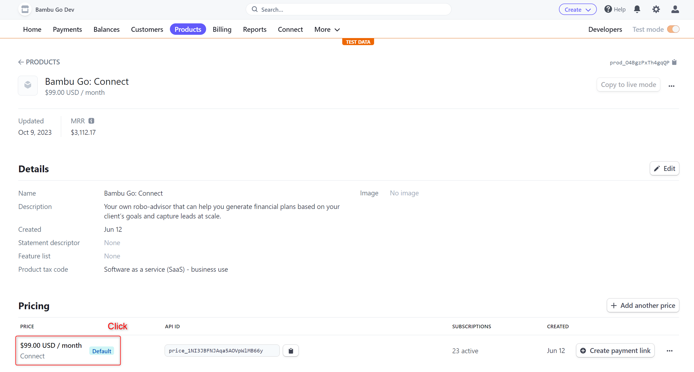
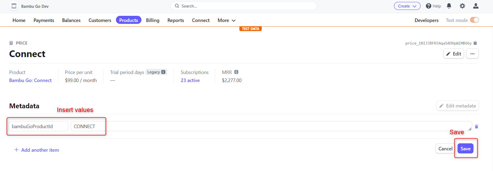

# Stripe Subscriptions

Refer to https://stripe.com/docs/billing/quickstart

# Cheatsheet

**Credit Card Numbers**

- Successful Payment: `4242 4242 4242 4242`
- Payment Needs Auth: `4000 0025 0000 3155`
- Payment Declined: `4000 0000 0000 9995`

# Strip Subscriptions Setup
In order to enable the selection of different subscription types, additional metadata needs to be added to the subscriptions in the stripe dashboard.
Please follow the steps below to add the necessary metadata for the subscriptions to work:

**Prerequisites**
1. User has access to the stripe dashboard.
1. User has access to the respective stripe environment(s) that they would need to perform the changes.

**Steps**
1. Select the stripe environment that you would like to perform the the changes on at the top left corner of the stripe dashboard.
1. Click on "Products" tab at the top panel.
1. Click on the Product with name "Bambu Go: Connect".

1. In the product details page, navigate to "Pricing" and select "$99.00 / month" to enter the pricing page.

1. In the price details page, click on "Edit metadata".
1. Insert a new key-value-pair with key=bambuGoProductId and value=CONNECT.
1. Click on "Save".

1. Next we will do it for the "Transact" subscription type.
1. Click on "Products" tab at the top panel.
1. Click on the Product with name "Bambu Go: Transact".
1. In the product details page, navigate to "Pricing" and select "$499.00 / month" to enter the pricing page.
1. In the price details page, click on "Edit metadata".
1. Insert a new key-value-pair with key=bambuGoProductId and value=TRANSACT.
1. Click on "Save".

These metadata is crucial for us to identify the subscription in stripe. 
Subscription will not work if this is not being set up.

# Stripe Subscriptions Update with Proration
<URL>/advisor-subscription-update
String subscriptionId // Get existing subscriptionId and insert here.
String priceId // Price to upgrade to. Prorated amount will be calculated
and billed accordingly.