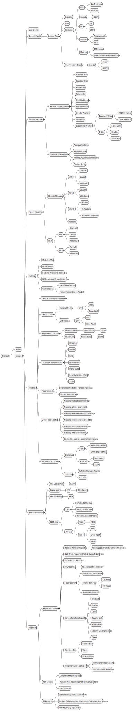

# Current Landscape of Trade Related Items

## TODO:
- [x] Clawback
- [x] Money reversal
- [x] REPORTS !!
- [ ] KYC status flows
- [ ] Mechanism to handle data conflicts due to multiple sources of truth (alerts vs CRON)
- [ ] Idempotency/safely-recompute when it comes to decisions made on how asset allocations are computed.
  - [ ] Determine how stale the data is and make decisions based on that.
  - [ ] Have a good model on how stale the data is when it comes to making asset allocation decisions. Keep in mind, data presented to the user could be stale, time stamp the holding information perhaps? Data could be stale between the time of execution, execution result and current market conditions.

## Notes:
1. Sequence of account type priorities:
   1. Individual Trader
   2. IRA Traditional
   3. IRA ROTH
   4. Joint Trader
2. Cheques would be lower priority, however, small FAs like cheque's. 
3. Need to put security lending interest in specs.
