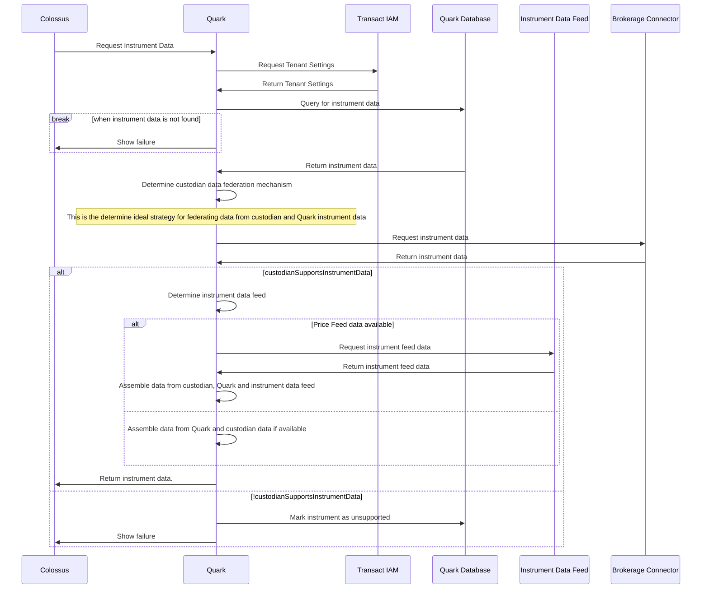
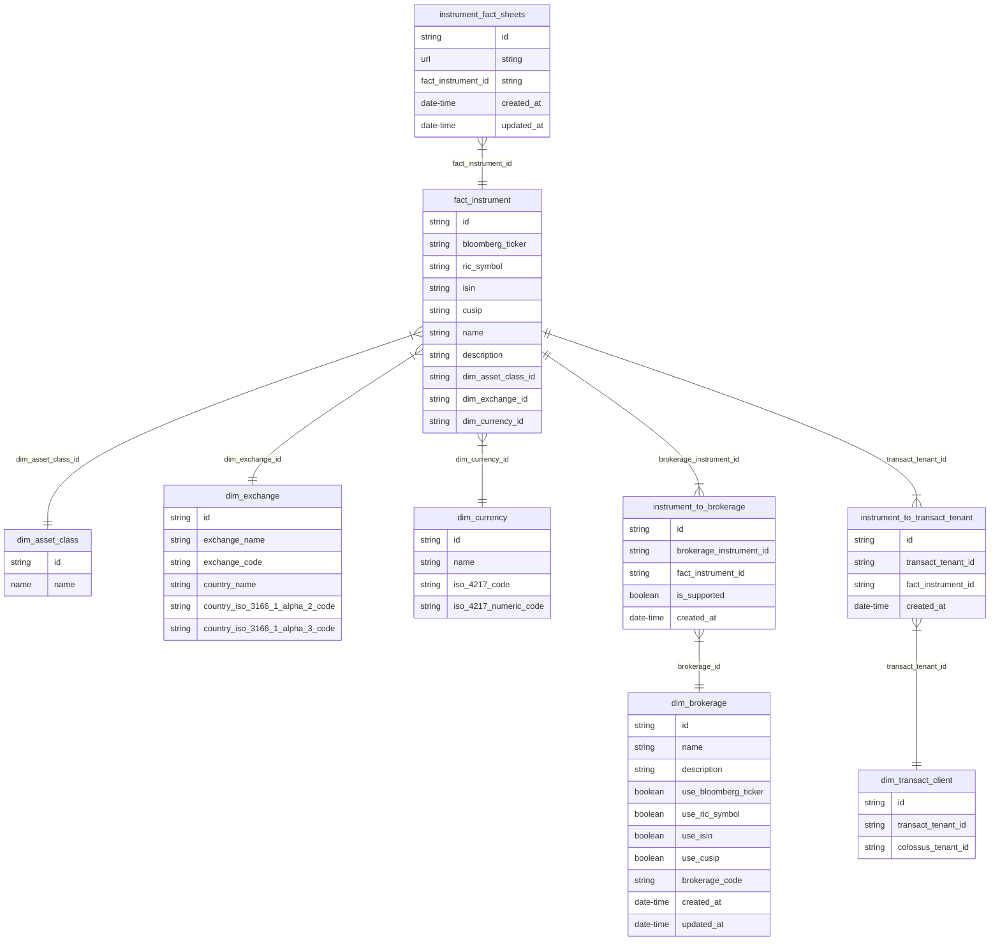

# Transact Instrument Universe (Quark)

The purpose of this is to draft the design of the instrument universe for Transact platform.
The instrument universe is the set of all instruments that can be traded on the platform.

The namesake of this module is Quark from Star Trek, a guy who deals in commodities (albeit black-market), and also is the element that makes up protons and neutrons, a fundamental constituent of matter in physics.
Since having instruments to trade is a fundamentally tied to instruments, figured this is apt.

**Physics Quark**


**Fictitious....I mean Star Trek Quark**


I just want code names that are simple, rather than full on module names that are verbose.

## Instrument Universe

Bambu will maintain its own instrument universe.
This is a list of all instruments that can be traded on the platform.
However, there will be integrations with external data providers to facilitate trading, and maintenance of the instrument universe.

These integrations are:

1. Broker/custodian connector service.
    1. This refers to a connector service/module that will proxy communication between the broker/custodian and Quark.
    2. This will act as a mapping tool for unique ids between the broker/custodian and Quark.
    1. SAXO and DriveWealth have their own unique ID systems that will require mapping to CUSIP, ISIN, Reuters RIC, and other mass adopted identifiers used in Quark.
    3. This will also act as a mapping tool for instrument types between the broker/custodian and Quark.
    1. SAXO and DriveWealth have their own instrument types that will require mapping to Quark's instrument types.
    4. This will also act as a filtering mechanism for instruments that are not supported by Quark or the broker/custodian.
        1. There could be instruments that aren't supported by custodians.
        2. Different asset classes can be enabled or disabled depending on the deal with the broker custodian.
            1. SAXO from experience seem to have the ability to enable/disable asset classes, region or origin, exchange, etc.
        3. Drive Wealth have distinct capabilities to enable/disable based asset class.
2. Instrument data feed
    1. It is becoming clear that we will need to have a data feed for instruments, as broker/custodians don't always have their own feeds (Wealth Kernel).
    2. This will be used to augment the instrument data we have. For starters, it will be:
        1. Closing price
        2. Live price
            1. Will probably need this for brokerages with pure unit trading capability and no notional support.

### Price Data Request Flow



### Quark Database Schema

The Quark database will be de-normalized and optimized for read performance.
The nature of Quark will be essentially master data, as there are no transaction write operations beyond initial configuration.



#### Rationale Behind DB Schema

The initial design of the database schema utilized a star schema. Based on the requirements derived at this point however, it was determined that a snowflake schema would be more appropriate.

A Star schema was initially chosen since the product universe is essentially a reporting tool.
What is done most of the time are read operations and no write operations will occur beyond initial configuration. User actions do not drive the data in Quark, unless when an instrument becomes unavailable for unforeseen reasons.
The Star Schema is a commonly used approach for building data warehouses and dimensional data models, and there are several reasons why it might be chosen over a traditional, normalized database schema:

1. **Simplicity**: Star schemas are easier to understand and use. Each fact table is surrounded by its associated dimension tables, making the relationship between tables quite clear. This contrasts with normalized database schemas, which can become very complex with many relationships between a large number of tables.

2. **Performance**: Star schemas are optimized for query performance in OLAP (Online Analytical Processing) scenarios, such as reporting and business intelligence, which require aggregating large volumes of data. These types of queries can be slow on normalized schemas, which require many joins between tables.

3. **Aggregation**: Star schemas are highly optimized for data aggregation. The denormalized structure allows for quick summarization of data and efficient querying, which is particularly useful for business analytics and reporting where aggregations are common.

4. **Data Predictability**: Data in star schemas is organized in a predictable way, which makes it easier for end users (like business analysts) to write queries without needing to understand a complex database schema.

5. **Separation of Operational and Analytical Processing**: Star schemas are often used in data warehousing scenarios, where the analytical processing is separated from transactional processing. This can improve the performance of both the operational systems and the analytical queries.

However, it's worth mentioning that while star schemas provide these benefits, they also have trade-offs. For instance, they are not as normalized as traditional database schemas, so they can consume more storage space due to redundancy, and they can be slower to update because updates might need to be made in multiple places. Also, star schemas are less flexible in terms of accommodating changes in business requirements, since such changes might require significant redesign of the schema.

A Snowflake schema would be a beneficial choice over a regular or star schema in the context of an investment product catalog linking brokerages, countries, exchanges, dates, and customers due to several reasons:

1. **Complex Relationships**: Investment product catalogs often involve complex relationships between various elements. For instance, a single brokerage might operate in multiple countries and offer a variety of investment products. Customers might deal with multiple brokerages and invest in multiple products. This level of many-to-many relationships can be handled efficiently with a Snowflake schema as it supports complex and hierarchical relationships.

2. **Data Normalization**: Snowflake schemas are fully normalized, which means there's less redundancy and duplication. This helps in maintaining the accuracy of data and can result in substantial storage savings over time, which is especially beneficial for large databases common in finance.

3. **Improved Query Performance**: With a Snowflake schema, data can be categorized in a way that queries on related data points will generally be faster, due to the reduced volume of data that needs to be scanned. This is particularly advantageous when dealing with large datasets like the ones used in financial systems, where performance is critical.

4. **Ease of Update**: Because of the reduced redundancy in Snowflake schema, updates, inserts, and deletes are easier and less prone to errors. If you need to change some aspect of a dimension (like an exchange's details), you only need to do it in one place, not in every record of a fact table, as might be the case in a star schema.

5. **Detailed Analysis**: Snowflake schemas are ideal for detailed analysis due to their depth and complexity. For instance, if you want to analyze the investment patterns in different countries or across different exchanges, the Snowflake schema can provide a clear path to drill down into this kind of detail.

In contrast, a regular database schema or a star schema might not be able to efficiently handle the complex relationships and the scale of the data involved in your case. However, one disadvantage of a Snowflake schema is that it can be more complex to understand and navigate due to its many-to-many relationships and hierarchical structure. But in a system with complex relationships like the one you're working with, it might be a worthy trade-off for the advantages in data normalization, performance, and detailed analysis.

We may end up using another approach, but this is the current thinking.

##### Read more

1. [Star Schema](https://en.wikipedia.org/wiki/Star_schema)
2. [Snowflake Schema](https://en.wikipedia.org/wiki/Snowflake_schema)

## Instrument Universe API List

The initial APIs would be as follows:

| # | HTTP Verb | Path                            | Description                 |
|---|-----------|---------------------------------|-----------------------------|
| 1 | GET       | `/api/v1/instruments`           | Get/search all instruments. |
| 2 | GET       | `/api/v1/instruments/{quarkId}` | Get an instrument by id.    |

Notice in API # 2, it says `quarkId`, we will be using Bambu specific IDs for instruments, and not the IDs from the broker/custodian.
This is to ensure consistency because brokers such as DriveWealth and SAXO do not have a consistent ID system.
In the case of APEX, different APIs use different IDs, and the IDs are not consistent across the APIs.

You will notice the `lastClosingPrice` and `lastClosingPriceDate` fields in the response payloads.
This is here for future purposes when we have price feeds in place. If none are in place, they will be `null`.

Please note that this is just high level guidance. Actual implementation may differ.

### Instrument Universe API #1

URL: `/api/v1/instruments?pageIndex=0&pageSize=50&search=`

| # | Query String | Is Required | Description                                                                                                                                                                            | Additional Notes                           |
|---|--------------|-------------|----------------------------------------------------------------------------------------------------------------------------------------------------------------------------------------|--------------------------------------------|
| 1 | `pageIndex`  | No          | The page index to return.  Zero based number. Defaults to `0`.                                                                                                                         | -                                          |
| 2 | `pageSize`   | No          | Size of the returned dataset, must be `>=0` and `<=100`. Defaults to `50`.                                                                                                             | -                                          |
| 3 | `search`     | No          | Search string to filter instruments by. Filters based on `bloomberg_ticker`, `isin`, `cusip`, `ric_symbol`, `name` and `description` on the `fact_instument` table. Defaults to `null` | Min length must be 3 characters and above. |

*Response Payload:*

```json
{
  "pageIndex": "0",
  "numberOfPages": "10",
  "numberOfRows": "300",
  "data": [
    {
      "id": "cb8271d4-fa26-44b6-b2c3-ed1094f5b0af",
      "bloomberg_ticker": null,
      "ric_symbol": null,
      "isin": "IE00B5BMR087",
      "cusip": null,
      "name": "iShares Core S&P 500 UCITS ETF USD (Acc)",
      "description": "iShares Core S&P 500 UCITS ETF USD (Acc)",
      "assetClass": {
        "id": "d5b3b3a0-0b7a-4b1a-8b0a-0b9e1a0b9e1a",
        "name": "Equity"
      },
      "exchange": {
        "id": "d5b3b3a0-0b7a-4b1a-8b0a-0b9e1a0b9e1a",
        "exchangeName": "XETRA German Electronic Exchange",
        "exchangeCode": "XETR",
        "countryName": "Germany",
        "countryIso31661Alpha2Code": "DE",
        "countryIso31661Alpha3Code": "DEU"
      },
      "currency": {
        "id": "d5b3b3a0-0b7a-4b1a-8b0a-0b9e1a0b9e1a",
        "name": "Euro",
        "iso4217Code": "EUR",
        "iso4217NumericCode": "978"
      },
      "factSheets": [
        {
          "id": "eba81228-6678-4918-b2a9-1622edd1f317",
          "url": "https://www.ishares.com/uk/individual/en/products/251882/ishares-core-sp-500-ucits-etf-acc-fund?switchLocale=y&siteEntryPassthrough=true",
          "createdAt": "2021-01-01T00:00:00.000Z",
          "updatedAt": "2021-01-01T00:00:00.000Z"
        }
      ],
      "lastClosingPrice": null,
      "lastClosingPriceDate:": null
    }
  ]
}
```

### Instrument Universe API #2

URL: `/api/v1/instruments/{quarkId}`

| # | Path Parameter | Is Required | Description              | Additional Notes |
|---|----------------|-------------|--------------------------|------------------|
| 1 | `quarkId`      | Yes         | Put the id from `Bambu`. | -                |

*Response Payload*

```json
{
  "id": "cb8271d4-fa26-44b6-b2c3-ed1094f5b0af",
  "bloomberg_ticker": null,
  "ric_symbol": null,
  "isin": "IE00B5BMR087",
  "cusip": null,
  "name": "iShares Core S&P 500 UCITS ETF USD (Acc)",
  "description": "iShares Core S&P 500 UCITS ETF USD (Acc)",
  "assetClass": {
    "id": "d5b3b3a0-0b7a-4b1a-8b0a-0b9e1a0b9e1a",
    "name": "Equity"
  },
  "exchange": {
    "id": "d5b3b3a0-0b7a-4b1a-8b0a-0b9e1a0b9e1a",
    "exchangeName": "XETRA German Electronic Exchange",
    "exchangeCode": "XETR",
    "countryName": "Germany",
    "countryIso31661Alpha2Code": "DE",
    "countryIso31661Alpha3Code": "DEU"
  },
  "currency": {
    "id": "d5b3b3a0-0b7a-4b1a-8b0a-0b9e1a0b9e1a",
    "name": "Euro",
    "iso4217Code": "EUR",
    "iso4217NumericCode": "978"
  },
  "factSheets": [
    {
      "id": "eba81228-6678-4918-b2a9-1622edd1f317",
      "url": "https://www.ishares.com/uk/individual/en/products/251882/ishares-core-sp-500-ucits-etf-acc-fund?switchLocale=y&siteEntryPassthrough=true",
      "createdAt": "2021-01-01T00:00:00.000Z",
      "updatedAt": "2021-01-01T00:00:00.000Z"
    }
  ],
  "lastClosingPrice": null,
  "lastClosingPriceDate:": null
}
```

## Initial Development & Deployment Considerations

For the initial deployment, we will manually populate the instrument universe via Prisma Seeding scripts.

This includes the `instrument_to_brokerage` and `dim_brokerage` tables for Wealth Kernel.

Until we develop and interface to update it, we will be using one off population scripts.
