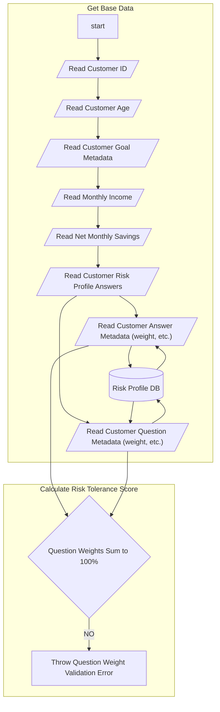

# Risk Profiling Logic

```mermaid
flowchart TD
  subgraph getBaseData["Get Base Data"]
  start --> getCustomerId[/Read Customer ID/]
  getCustomerId --> getCustomerAge[/Read Customer Age/]
  getCustomerAge --> getGoalMetadata[/Read Customer Goal Metadata/]
  getGoalMetadata --> getMonthlyIncome[/Read Monthly Income/]
  getMonthlyIncome --> getNetMonthlySavings[/Read Net Monthly Savings/]
  getNetMonthlySavings --> getCustomerRiskProfileAnswers[/Read Customer Risk Profile Answers/]
  getCustomerRiskProfileAnswers --> getCustomerAnswerMetadata[/"Read Customer Answer Metadata (weight, etc.)"/]
  getCustomerAnswerMetadata --> riskProfileDb[(Risk Profile DB)]
  riskProfileDb --> getCustomerAnswerMetadata
  getCustomerRiskProfileAnswers --> getCustomerQuestionMetadata[/"Read Customer Question Metadata (weight, etc.)"/]
  getCustomerQuestionMetadata -->  riskProfileDb
  riskProfileDb --> getCustomerQuestionMetadata
  end
  subgraph calculateRiskToleranceScore["Calculate Risk Tolerance Score"]
    getCustomerAnswerMetadata --> validateQuestionWeights{"Question Weights Sum to 100%"}
    getCustomerQuestionMetadata --> validateQuestionWeights
    validateQuestionWeights -- NO --> throwQuestionWeightValidationError["Throw Question Weight Validation Error"]
  end
```
