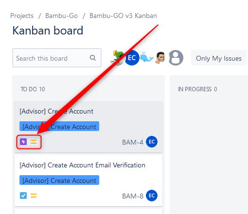
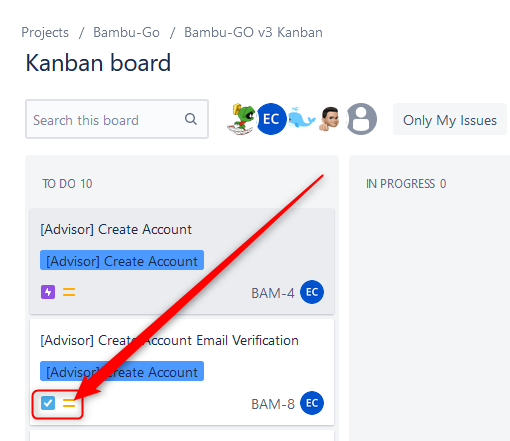

# Kanban Workflow

This document offers guidance on the Kanban workflow for the Colossus project.

This is a living document and will change over time.

## Where is the Kanban Board?

At the time of this writing, it is located at [https://bambulife.atlassian.net/jira/software/c/projects/BAM/boards/169](https://bambulife.atlassian.net/jira/software/c/projects/BAM/boards/169).

If you do not have access, please request from the Service Desk or ask the project PM.

## Why are there both epics and stories in the Kanban board?

While they both appear on the Kanban board, they serve very different purposes.

### Epics

Epics can be identified with the purple lightning icon on the lower left.

Epics are intended for utilization by the Business Analyst, Architects, Lead Developers, and Product Owners to oversee the general advancement of a module. 
The epics will furnish the functional overview pertaining to the module, but will not encompass any implementation details related to submodules such as acceptance criteria, technical constraints, and so on. 
Such details shall be documented in the `user stories, not in the epics`.

### User Stories

User stories can be identified by the blue tick icon on the lower left.

The tickets/tiles will supply `granular particulars absent in epics`. 
This will encompass the precise definition of the acceptance criteria by the Business Analyst. 
The acceptance criteria will be functional in character, from which the assigned developer will extract the technical execution.
Most of the time, developers will be using this to track their work and progress.

If the story appears excessively large to generate any output within a week, or at maximum two weeks, it must be subdivided into smaller stories. 

## Modus Operandi / SOP

1. Ideally, every user story should yield a deliverable weekly or biweekly.
2. Functional personnel use `epics` for tracking the progress of a module.
3. Functional personnel will furnish acceptance criteria in the `user stories` based on their understanding of the functional requirements.
   - Ideally each acceptance criteria should be written in Twitter length (240 characters) to make it direct and concise.
4. Technical personnel involved in software engineering tasks will look at `user stories` and tie their progress to them.
5. Technical personnel do not need to look at `epics` during day to day ops.
   - Developers only really need to look at `epics` to gain more context on the overall needs of the module and when planning out work to take.
