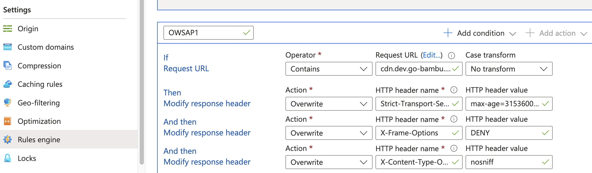

# OWASP Headers Playbook

This document details, how to configure and deploy owsap headers in our different environments.
To know more about OWSAP headers, refer to this document [owasp-headers](owasp-headers.md)

We are configuring these headers via the Azure CDN rules engine. This allows us to customise how content is delivered to users from the Azure CDN. Using simple logic statements, we can create rules to control things like content redirection and header modification.

Currently, we have the following static websites and asset blobs being served using Azure CDN:

Static FE Websites
1. Web Investor,
2. Web Advisor
3. Web Admin

Assets blobs
1. Web Assets
2. Web Tenant

We have configured the following headers with their respective values in the DEV environment.

## Headers for Static FE Websites

1. Strict-Transport-Security: max-age=31536000; includeSubDomains;

2. Content-Security-Policy: default-src 'self' dev.go-bambu.co *.dev.go-bambu.co blob:; style-src 'self' https://fonts.googleapis.com 'unsafe-inline'; font-src 'self' https://fonts.gstatic.com data:; connect-src 'self' https://config.ff.harness.io *.dev.go-bambu.co;

3. X-Frame-Options: DENY

4. X-Content-Type-Options: nosniff

5. X-Permitted-Cross-Domain-Policies: none

6. Referrer-Policy: no-referrer

7. Cross-Origin-Embedder-Policy: require-corp

8. Cross-Origin-Opener-Policy: same-origin

9. Cross-Origin-Resource-Policy: same-origin

10. Origin-Agent-Cluster: ?1

Note: The Content-Security-Policy header value can be updated according to the environment in which it's being deployed. For QA, 'self' should point to qa.go-bambu.co and *.qa.go-bambu.co; the same method should be followed for production.

## Headers for Assets blobs

1. Strict-Transport-Security: max-age=31536000; includeSubDomains;

2. X-Frame-Options: DENY

3. X-Content-Type-Options: nosniff

4. X-Permitted-Cross-Domain-Policies: none

5. Cross-Origin-Opener-Policy: same-origin

6. Content-Disposition: attachment

7. Access-Control-Allow-Origin: *

## How to deploy

This section will outline a step-by step guide on how to deploy the headers for a particular environment.

1. Select the appropriate environment resource group from the Azure Dashboard.
2. Find the CDN endpoint for which we want to deploy or modify the headers.
3. Select Rules Engine from the sidebar menu.
4. From the rule engine, we can modify the request and response headers by using condition and action pairs.

Here's a screenshot demonstrating the rules, which modify the response headers whenever the condition triggers.

Refernce
- https://learn.microsoft.com/en-us/azure/cdn/cdn-standard-rules-engine-reference
- https://learn.microsoft.com/en-us/azure/cdn/cdn-standard-rules-engine-actions

