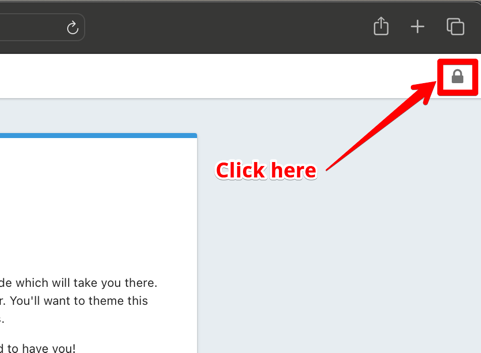
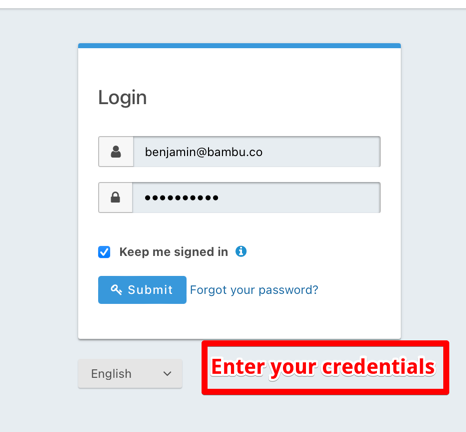
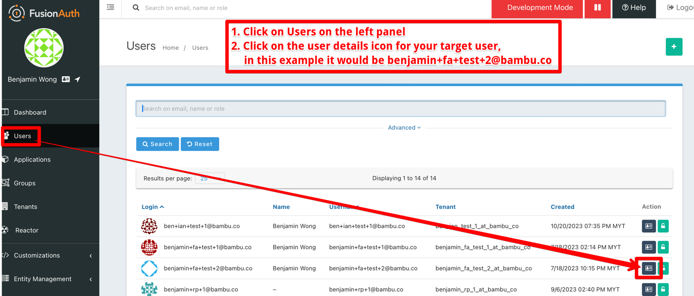
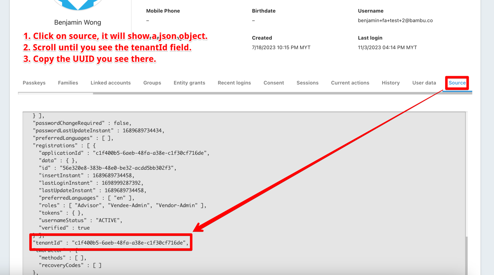

# Colossus Wealth Kernel Developer Setup

Colossus is designed as a scalable, multi-tenant investment platform. Each advisory firm or individual advisor using the platform is provided with a unique set of credentials to ensure secure and isolated access to their data.

As of the date of this document (2023-11-04), our initial release is tailored for the UK market. We have partnered with Wealth Kernel to leverage their services as our broker/custodian.

At present, Wealth Kernel and similar broker/custodians do not offer an automated API solution for the onboarding of advisory firms. As a result, we must facilitate a manual onboarding process for each advisory firm wishing to integrate with our platform.

This guide outlines the necessary steps to manually onboard advisory firms onto the Colossus platform.

## Identifying The Advisory Firms

Proper identification and binding of developer/test credentials are essential steps in preparing for the onboarding of advisory firms. Follow the steps below to identify and initiate the onboarding process.

### Via Advisor Front End

*Note:* The development of this feature is currently in progress and is not yet available. Updates will be provided as the feature reaches completion.

### Via Manual Process

To manually identify an advisory firm within your environment, please follow the process detailed below:

```text
Note:
For the purposes of this guide, we will use the fictitious advisory firm, with the following identifiers:

1. Email Login: benjamin+fa+test+2@bambu.co
2. Password: Bambu@2023
3. Colossus Identifier: c1f400b5-6aeb-48fa-a38e-c1f30cf716de
```

#### Step 1: Identify The Advisory Firm

You can find the tenant id easily via Fusion Auth via the advisor's email/username.
The following screenshots show how to find the tenant id via the Fusion Auth UI.

| # | Description                                     |
|---|-------------------------------------------------|
| 1 | Go to http://localhost:9011                     |
| 2 |                     |
| 3 |                      |
| 4 |       |
| 5 |  |

#### Step 2: Doctor The Advisor Subscription

```text
Prerequisites:

This step assumes you have subscribed via Stripe. 
If you have not, please do so.

Assumptions:
We are illustrating this using test data here.
In this case the tenant id acquired from the previous step which is c1f400b5-6aeb-48fa-a38e-c1f30cf716de.
```

Now that you have the tenant id, you can doctor the advisor subscription.

Run the following query:

```sql
UPDATE public.tenant_subscriptions 
SET 
    bambu_go_product_id = 'TRANSACT', 
    is_interested_in_transact = true 
WHERE tenant_id = 'c1f400b5-6aeb-48fa-a38e-c1f30cf716de';
```

This would have set the advisor's subscription to Transact.
If it is not clear with the earlier notes, the `tenant_id` used here is purely for illustration purposes.
Replace it with the actual tenant id you have acquired from the previous step.

#### Step 3: Run the Onboarding Script

There is a script at `libs/@bambu/server-core/db/central-db/dev-seeding-scripts/seed-wk-credentials.sql`.
Run that script to seed the Wealth Kernel credentials for your advisor.
There is no need to edit it as it will read parameters based on the previous steps.
This script is also idempotent, so you can run it multiple times without any issues.

#### Step 4: Run the Trading Portfolio Script (Optional)

There is a script at `libs/@bambu/server-core/db/central-db/dev-seeding-scripts/2023-10-26-seed-model-portfolio.sql`.
This is optional but recommended as it seeds trading portfolios and model portfolios for your advisor.

## Conclusion

You should have now successfully identified and initiated the onboarding process for an advisory firm. If you have any questions or concerns, please reach out in slack for assistance.
