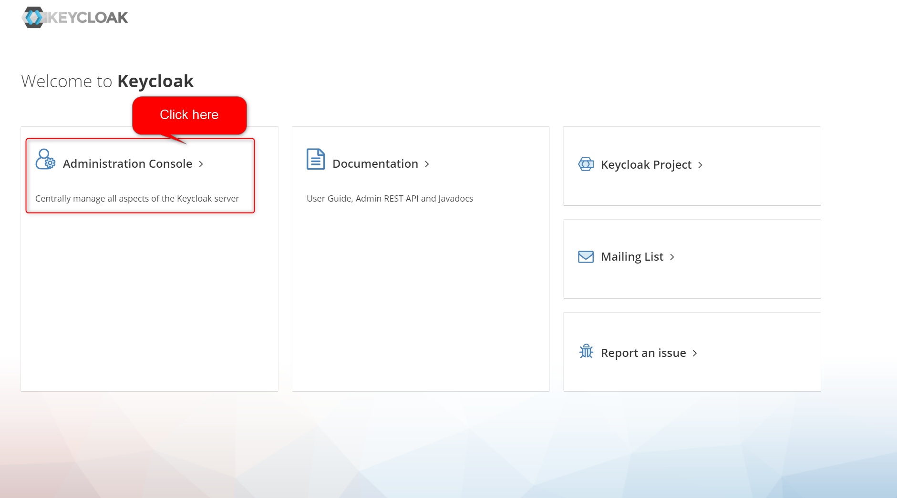
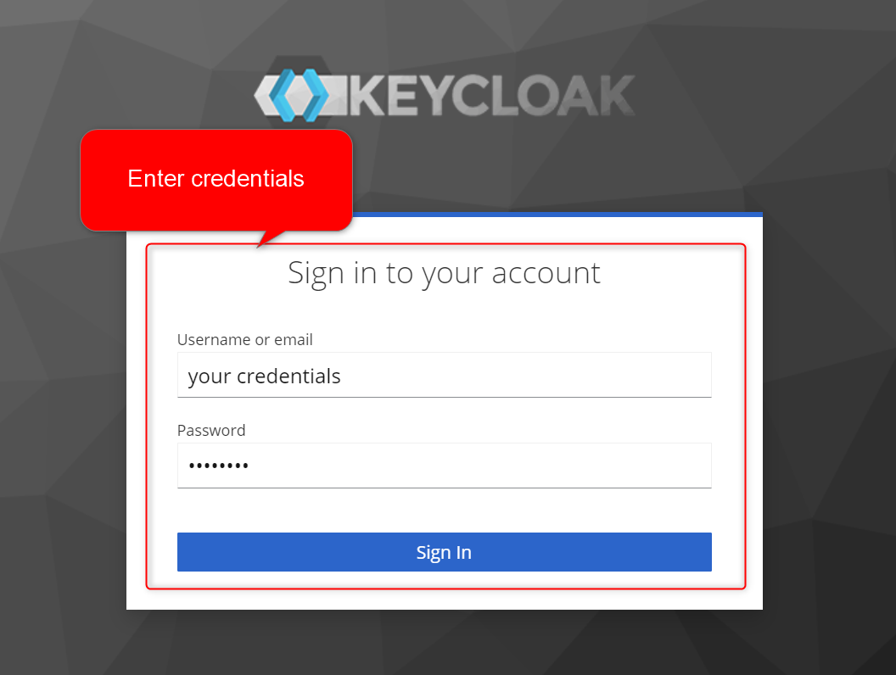
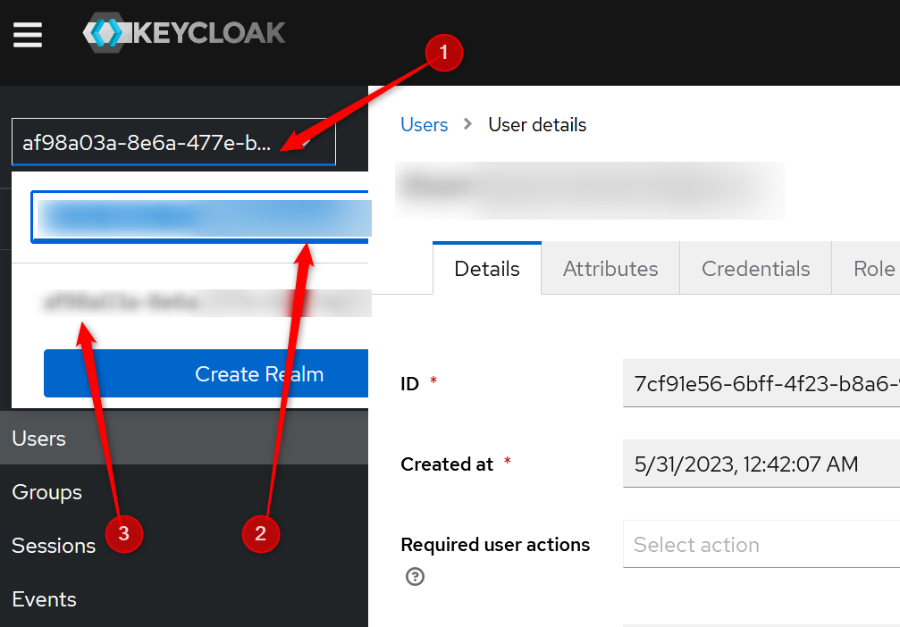
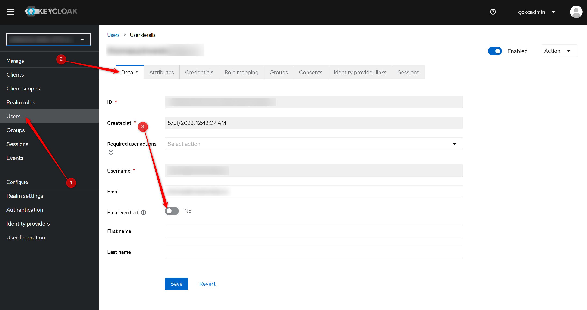

# OTP Not Verified Problem

At the time of this writing (`2023-05-31`) there is a potential issues related to OTP verification. They are:

1. User does not enter OTP within 5 minutes and does not resend the OTP due to user error.
2. The user navigates away before OTP is entered. There is no recovery mechanism for this.

## Solution

### Step 1 - Acquire Tenant ID

A derivative of the tenant's email is stored as a `realm` in the `Tenant` table. This is used to identify the tenant.

For example, if the user's email is `thomas@problem-user.co.uk`, run the following query:

```sql
SELECT t.*
FROM public.tenants t
WHERE realm like '%thomas%'
LIMIT 501
```

This should narrow down the tenant to a single record. If not, do some additional checks to get the right one.
From here, you can get the `tenant id` from the `id` column.

### Step 2 - Update Tenant User Verified Flag

Log into the KeyCloak admin page. The urls are:

1. PROD - `https://api.go-bambu.co/auth`
2. DEV- `https://api.dev.go-bambu.co/auth`

The following screenshots will guide you to the right place.

*Action 1*:


*Action 2*:


*Action 3*:


| # | Description                                                                 |
|---|-----------------------------------------------------------------------------|
| 1 | Click on the drop down of realms.                                           |
| 2 | Fill in the ID acquired from `Step 1` here.                                 |
| 3 | Once the ID is filtered, there should only be one result, click on that ID. |

*Action 4*:



| # | Description                                           |
|---|-------------------------------------------------------|
| 1 | Click on the `Users` tab.                             |
| 2 | Click on the `Details` tab.                           |
| 3 | Click on the switch to make `Email verified` to true. |

*Action 5*:

Click save after items from `Action 4` are completed.

### Step 3 - Update Tenant User OTP Used Status

Run the following query to update the OTP used status:

```sql
UPDATE public.otp
SET otp_state = 'USED'
WHERE tenant_id = '<tenant id from Step 1>'
```

Note that there is only 1 user per tenant at this moment.
When we have multiple users per tenant, we will need to update the query to include the user id.
