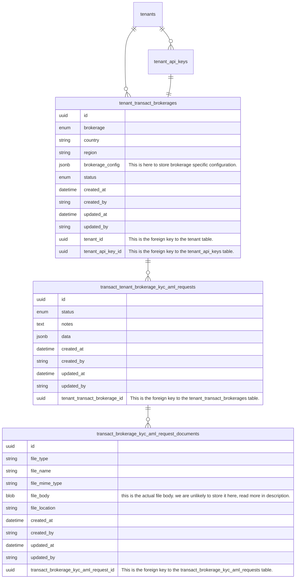
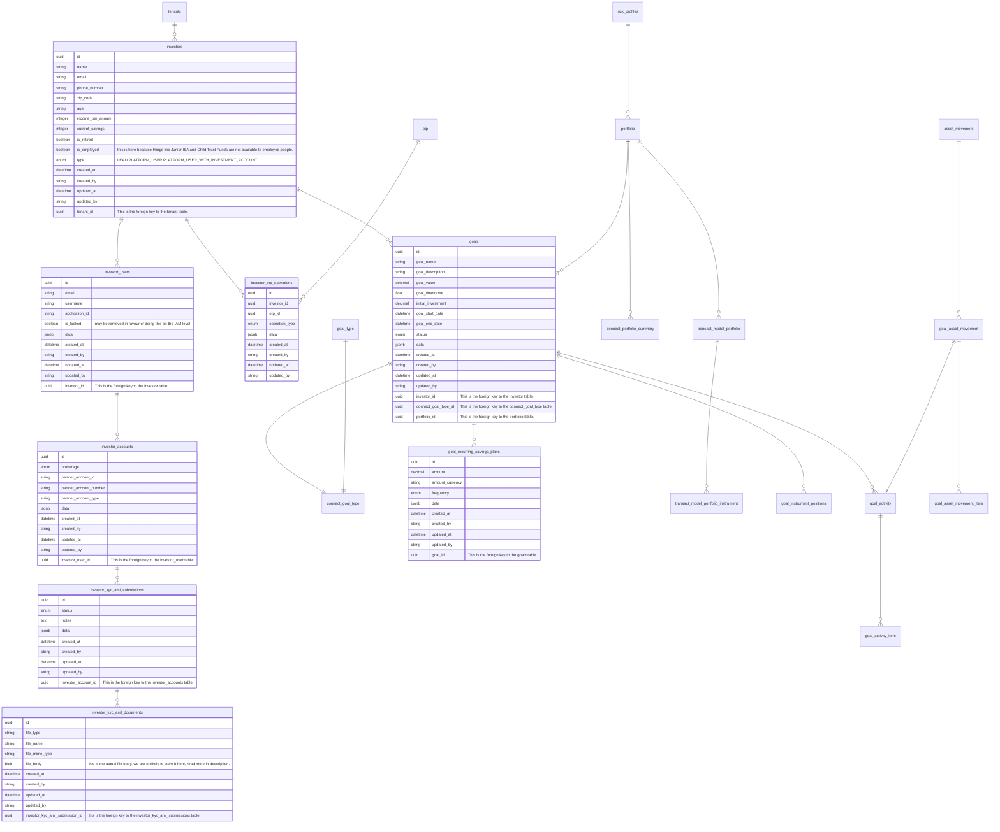
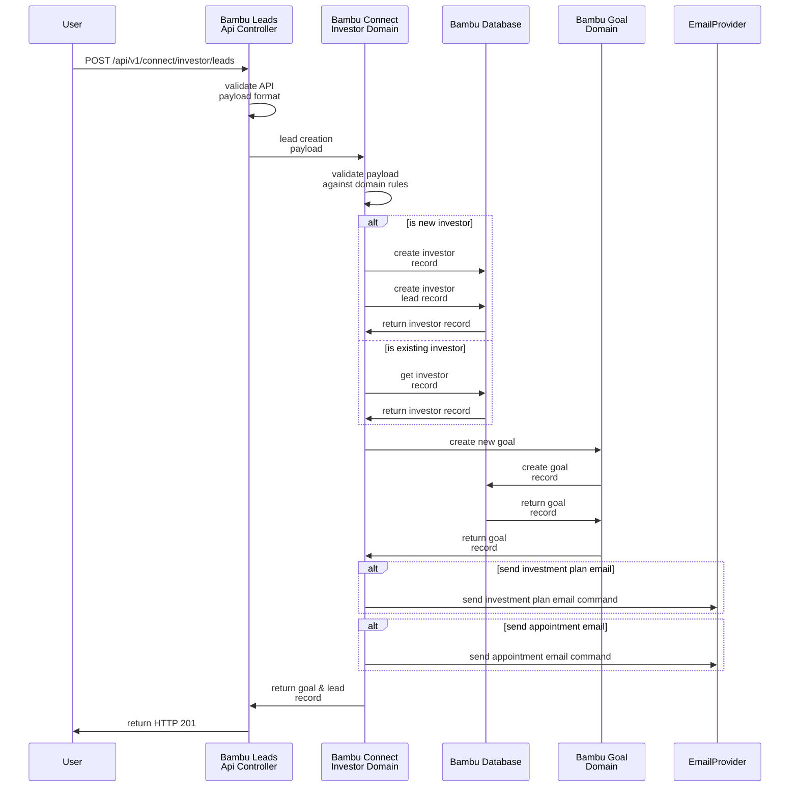
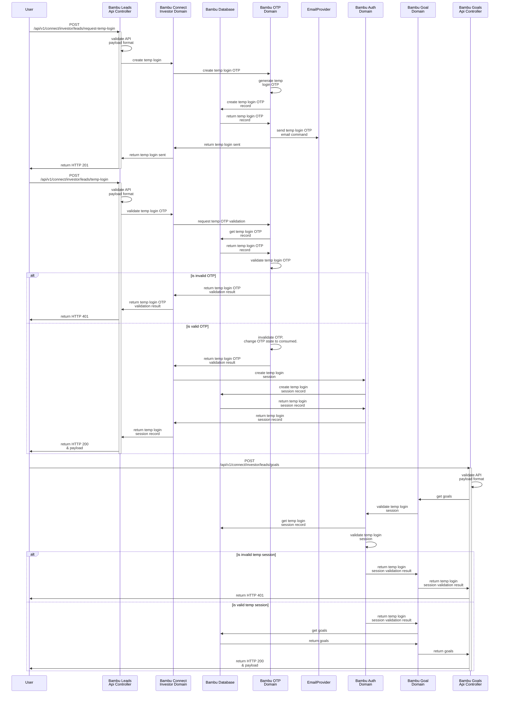
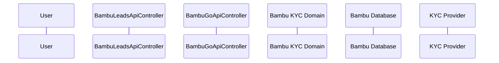

# KYC Specifications

The purpose of this document is to describe the KYC process for the Bambu GO platform.

This KYC Process will also include a revamp of the current KYC process for Bambu Leads.

This document will provide a high level description of how things should be.
This is not a detailed technical document.
The purpose of this document is to provide a high level description of the process.
During execution, the technical details will be worked out by the implementation team.

## Database ERD

This section will describe the database ERD for the new KYC process.
There will be significant changes to the current data model to accommodate it.
Bear in mind that this is a high level description of the data model.
Actual implementation may differ.
Note that existing tables will not be detailed here.

### Advisor KYC ERD

*Figure 1 - Database ERD for Advisor KYC*

In this case all the tables are new, existing tables do not need to be augmented.

The following are the descriptions of the tables:

1. `tenant_transact_brokerages`
   1. This table will store the brokerage information for the tenant.
   2. While in theory we can support more than 1 brokerage per tenant, for initial implementation, only 1 can be used at any given time. The multi brokerage capability will be something we build in the future.
   3. The `brokerage` field is an enum field that will store the brokerage name. This will be used to determine which brokerage to use.
   4. The `country` and `region` columns are string fields that will store the country and region of the brokerage.
      1. This data is stored for querying and later analytics usage.
      2. It also theoretically allows us to support multiple brokerages per tenant for different countries.
      3. For instance, a bank in Malaysia may want to use `SAXO` for international trading but `N2N` or `ExcelForce` for local Malaysian bursa trading. 
   5. The `brokerage_config` field is a jsonb field that will store the brokerage specific configuration. Currently, it is stored as `JSONB` as it allows us to store any arbitrary data. In the future, we may want to consider moving columns out of the `JSONB` column and into a separate column or table.
   6. The `status` enum column will track the status of the brokerage. 
      1. The proposed statuses are:
         1. `PENDING` - The brokerage has not been configured yet and awaiting KYC from brokerage.
         2. `KYC_IN_PROGRESS` - The brokerage is performing KYC on the tenant.
         3. `KYC_FAILED` - The brokerage has failed KYC on the tenant.
         4. `CONFIGURATION_IN_PROGRESS` - The brokerage is being configured.
         5. `CONFIGURATION_FAILED` - The brokerage configuration has failed.
         6. `ACTIVE` - The brokerage is ready to be used and is active.
         7. `DEACTIVATED` - The brokerage has been deactivated.
      2. These statuses are just proposed statuses, more can be added or subtracted during refinement or during implementation.
2. `transact_brokerage_kyc_aml_requests`
   1. This table tracks the KYC/AML requests made to the brokerage from the tenant.
   2. The reason for this is that we might want to track the multiple KYC/AML requests made to the brokerage for audit trail purposes.
   3. This can contain the 1st application, subsequent applications due to failed KYC/AML, reactivation of brokerage, etc.
   4. The `data` column is a `JSONB` column that will store the data sent to the brokerage. This is a purely optional field can will have different schemas depending on the brokerage and business rules.
3. `transact_brokerage_kyc_aml_request_documents`
   1. The tracks the documents sent to the brokerage for KYC/AML.
   2. The columns should be self-explanatory.
   3. The `file_type` is used to classify the document. This is a string/varchar column as each brokerage may have different document types.  
   4. Ideally the `file_body` is not stored in the DB, rather we should use a separate mechanism.
      1. The reason for this is that storing the file body in the DB will increase the size of the DB and make it harder to manage.
      2. There are also compliance issues with storing the file body in the DB. We should instead opt for temporary storage of the documents in something like `Redis` where it will disappear when the time lapses.
      3. Should `Redis` not be suitable, we can:
         1. Store it in `Azure Storage` or an `S3 Bucket` and have a CRON Job purge the file after a certain time.
         2. Store it in the database and have a CRON Job purge the file after a certain time. However, storing it in the database will have performance implications down the line.
            1. Storing it as `BLOB` rather than `TEXT` or `BYTEA` will make it manageable in the short term but is less than ideal (https://wiki.postgresql.org/wiki/BinaryFilesInDB).
      4. We should be using something like `AWS KMS` or `Azure KeyVault` to encrypt the files for storage and decrypt the files when used to prevent unwanted leakage of data.
      5. If we are not using the database, we can use the column `file_location` to show where it is.
         1. If we use `Redis`, we can store the key in the `file_location` column.
         2. If we use something like `AWS S3 Buckets` or `Azure Storage`, we can store the path or URL in the `file_location` column. 

### Investor KYC ERD

*Figure 2 - Database ERD For Investor KYC*

In *Figure 2*, it illustrates the overall database ERD revamp for the investor KYC process and transact in general.
This is to better illustrate the data model for the investor KYC process and how it will fit into the overall transact data model.

Also, in *Figure 2*, you will notice that the column `data` with the datatype `JSONB` is present in multiple tables.
The reason for this is that we want to store arbitrary data in the database that may not fit all brokerages and use cases. 
`JSONB` gives us the flexibility to store it as JSON and query it as needed. `JSONB` in PgSql is also indexed and can be queried efficiently, unlike `JSON` in PgSql.

The following are the descriptions of the tables:

1. `investors`
   1. This table stores the investor information.
   2. This is the successor of the `leads` table.
   3. This table only stores metadata pertinent to the investor. The goal related data is stored in the `goals` table.
   4. The investor type is stored in the `type` column. The following are the investor types:
      1. `LEAD` - This is a lead that has not been converted to a platform user.
      2. `PLATFORM_USER` - This is a platform user that has not been converted to a platform user with an investment account.
      3. `PLATFORM_USER_WITH_INVESTMENT_ACCOUNT` - This is a platform user with an investment account.
   5. Once the type becomes transitions from `LEAD` to `PLATFORM_USER`, the `PII` information (email, name, etc.) will be nullified and the data will be moved to the IAM system.
2. `investor_otp_operations`
   1. This table will act as a bridge between the `OTP` and `investor_table`, binding the data.
   2. This table may change as be consolidated with the OTP table during implementation. However, for now, it is a separate table.
   3. This table will facilitate OTP operations that are denoted by the `operation_type` column.
      1. `TEMP_LOGIN` - This is used to facilitate temporary logins. This only applies if the user has not been converted from `LEAD` to `PLATFORM_USER`.
      2. `RESET_PASSWORD` - This is used to facilitate password resets.
      3. `CHANGE_PASSWORD` - This is used to facilitate password changes.
      4. `CHANGE_EMAIL` - This is used to facilitate email changes.
      5. `CHANGE_PHONE_NUMBER` - This is used to facilitate phone number changes.
      6. `SUBMIT_KYC` - This is used to facilitate KYC submissions.
      7. `UPDATE_DETAILS` - This is used to facilitate updates to investor details.
   4. One of the uses of the `data JSONB column` is to store JWT tokens used in temporary logins.
3. `investor_users`
   1. This table will be populated once the investor is converted from `LEAD` to `PLATFORM_USER`.
   2. This table will store platform user specific information.
   3. The `application_id` determines which application/module the user is signing on to. In the case of the current implementation, it will denote which FusionAuth IAM Tenant application to sign in to.
   4. The `email` and `username` is stored here for easy matching to the IAM system. The currently implemented IAM allows sign in to the system using either the email or username.
   5. The `is_locked` column is one column that may be removed from implementation as it is possible to do so in the IAM platform. However, it is here for now for completeness.
4. `investor_accounts`
   1. An account here basically means brokerage/custodian/investment account.
   2. The `brokerage` column is shared with the advisor's `transact_tenant_brokerage_kyc_aml_requests` table to denote the brokerage this is for.
   3. The `partner_account_id` and `partner_account_number` is used to denote the account number in the brokerage.
      1. This is in place as brokerages like `SAXO` and `DriveWealth` have different identifiers for accounts that are used for different purposes.
   4. The account type is stored in the `partner_account_type` column. This is used to denote the type of account in the brokerage.
      1. Brokerages typically have different account types for different purposes.
      2. For instance, in the APEX, they have different accounts for `IRA`, `Roth IRA`, `Individual Trader`, etc.
5. `investor_kyc_aml_submissions` & `investor_kyc_aml_documents`
   1. These tables are similar to the advisor's `transact_tenant_brokerage_kyc_aml_requests` & `transact_brokerage_kyc_aml_request_documents` tables.
   2. The `investor_kyc_aml_submissions` table tracks the KYC/AML submissions made to the brokerage from the investor.
   3. The `investor_kyc_aml_documents` table tracks the documents sent to the brokerage for KYC/AML.
   4. The columns should be self-explanatory.
   5. The `file_type` is used to classify the document. This is a string/varchar column as each brokerage may have different document types.
   6. If we are to use the DB to store and submit:
      1.  The `investor_kyc_aml_submissions` will have the primary submission data stored in the `data` column. This enables the data contract/shape/format to accommodate any brokerage.
      2. The `notes` column is to allow the for annotations to be made by the approving party. This use case may change in actual implementation.
      3. The `investor_kyc_aml_documents` will have the actual documents and supporting metadata.
         1. The `file_body` is the actual file body. This is stored as `BLOB` as it is the most efficient way to store binary data in PgSql.
      4. Once submitted to the brokerage/custodian, the `data` column in `investor_kyc_aml_submissions` should be nullified and the document content in the `file_body` column in `investor_kyc_aml_documents` should be purged after a preferably short period of time.
         1. The source of truth should be from teh custodian/brokerage and not the Bambu GO Platform.
      5. The KYC form data and documents should only be retained for a period of time, if the user does not submit the KYC data, the data should be purged.
         1. The reason for this is that we do not want to be storing sensitive data for long periods of time.
   7. If we do not use the DB, and instead we use something like `Redis` or `AWS S3` or `Azure Storage`, the `file_body` column will be replaced with a `file_location` column that will store the location of the file.
      1. If we use `Redis`, we can store the key in the `file_location` column.
      2. If we use something like `AWS S3 Buckets` or `Azure Storage`, we can store the path or URL in the `file_location` column.
6. `goals`
   1. This is one of the tables that supersede the `leads` table. All the goal related data is stored here.
   2. The `goal_name` and `goal_description` is self-explanatory.
   3. The `goal_value` is the target value of the goal.
   4. The `goal_timeframe` is the target timeframe of the goal.
   5. The `initial_investment` is the initial investment amount of the goal.
   6. The `goal_start_date` and `goal_end_date` is the start and end date of the goal. This will be populated once goal funding starts.
   7. The `status` column is used to track the status of the goal.
      1. The proposed statuses are:
         1. `PENDING` - The goal has not been funded yet.
         2. `FUNDING` - The goal is being funded.
         3. `ACTIVE` - The goal is active.
         4. `COMPLETED` - The goal has been completed.
         5. `CLOSED` - The goal has been closed.
      2. These statuses are just proposed statuses, more can be added or subtracted during refinement or during implementation.
   8. The `data` column is to store JSON data that is pertinent to the goal. This is to accommodate any arbitrary data that may be needed for the goal.
7. `goal_recurring_savings_plans`
   1. This table is used to store the recurring savings plans for the goal.
   2. The `amount` is the amount to be saved.
   3. The `amount_currency` is the currency of the amount to be saved.
   4. The `frequency` is the frequency of the savings.
      1. The proposed frequencies are:
         1. `DAILY` - The savings is daily.
         2. `WEEKLY` - The savings is weekly.
         3. `MONTHLY` - The savings is monthly.
         4. `QUARTERLY` - The savings is quarterly.
         5. `YEARLY` - The savings is yearly.
      2. For initial implementation, only `MONTHLY` will be supported.
      3. These frequencies are just proposed frequencies, more can be added or subtracted during refinement or during implementation.
   5. The `data` column is to store JSON data that is pertinent to the recurring savings plan. This is to accommodate any arbitrary data that may be needed for the recurring savings plan.

## New Leads Flow

This section will show the new revamped flow for processing leads.

### Creating A New Lead Flow

The following diagram describes a new flow for processing leads.

*Figure 3 - Creating A New Lead Flow*

The new flow has the new additions:

1. Goals and leads are now separate entities.
2. The lead creation process is now a separate process from the goal creation process.
3. The current process will only have one lead to one goal. If the user wants to create multiple goals, they will have to create multiple leads with different emails. This is now no longer the case.

### Lead Temp Login Flow

The following diagram describes the flow for creating a temporary login for a lead.

## KYC Process

