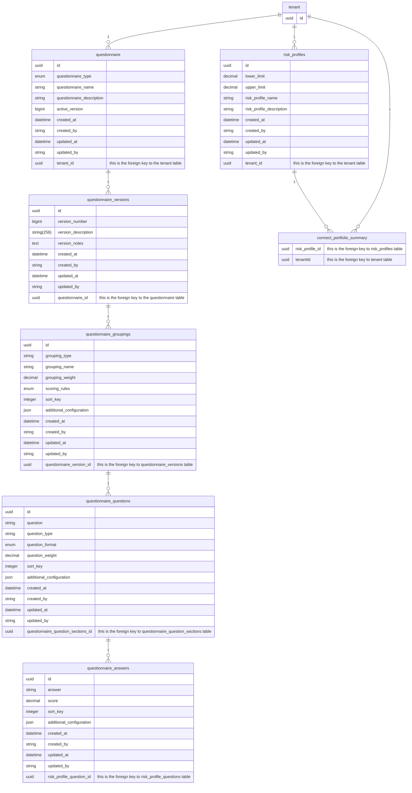
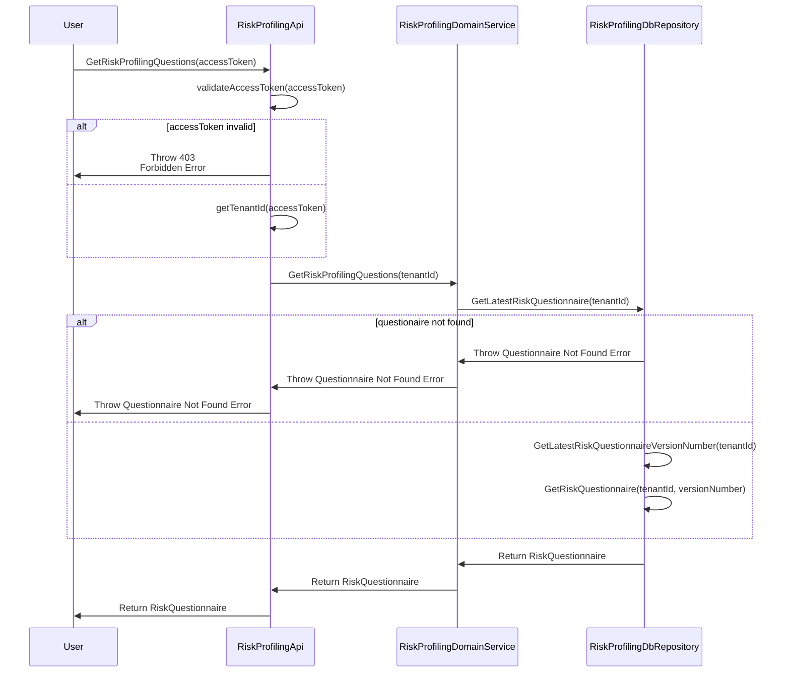
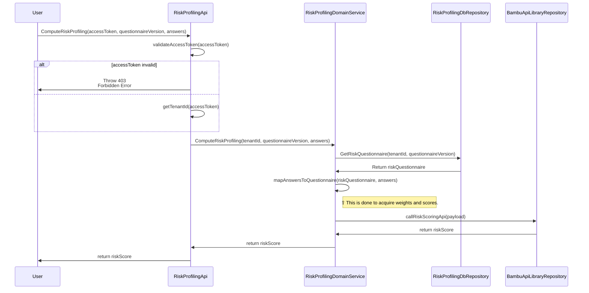
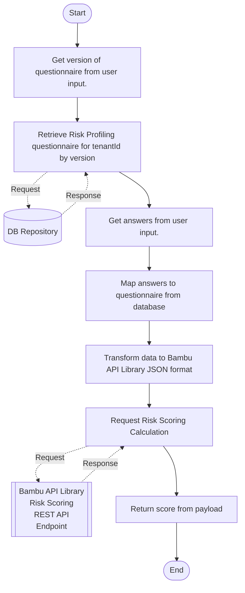

# Risk Profiling Specs

This document will outline the risk profiling module for Bambu GO.

## Database Schema

Below is the database schema for the risk profiling module. 
This is not a detailed ERD, it is just a high level overview of the tables and their relationships to communicate the concepts behind it.
The implementation team can refine it on execution.

The `connect_portfolio_summary` and `tenant` tables are existing tables. The rest are new tables.


*Figure 1 - ERD*

The philosophy around this database diagram is to design it for future use cases and to be as flexible as possible.
Some things to note:

1. The reason why versioning is there is twofold:
   1. To allow for the questionnaire to be updated without affecting the existing data.
   2. To allow for an audit trail of changes for compliance reasons.
   3. To allow customers to have a publish/rollback feature later down the line.
2. We `DO NOT` have to implement `ALL` the capabilities that this tables facilitates in the application code. 
   For instance, just because we have versioning capability, does not mean to need to surface versioning and publish/review in the front end. 
   What the database table structure can handle is not the same as what the server and front end capabilities.
3. The `questionnaire.active_version` column is used to denote which version is the active version. 
   This is to make it easier for us to query the active version of the questionnaire.
4. There will be several enums in this table. These enums are enums stored in the `APPLICATION CODE & NOT THE DATABASE ENUMS` to make it easier for us to migrate data. 
   These enums are:
   - **QuestionnaireTypeEnum**
     - Table Name: `questionnaire` 
     - Column name: `questionnaire_type`
     - Values:
       - `RISK_PROFILING`
         - Denotes this questionnaire is meant for risk profiling. 
       - `OTHER`
         - For other uses.
         - This won't be used at all for the time being. This is just here for future use cases.
   - **ScoringRulesEnum**
     - Table Name: `questionnaire_groupings`
     - Column name: `scoring_rules`
     - Values:
       - `MIN`
         - Denotes that the score for this will be the lowest score of all the answers in this grouping.
         - This is to facilitate the case where we want to have a minimum score for a grouping. 
       - `MAX`
         - Denotes that the score for this will be the highest score of all the answers in this grouping.
         - This is to facilitate the case where we want to have a maximum score for a grouping.
       - `AVERAGE`
         - Denotes that the score for this will be the average score of all the answers in this grouping.
         - This is to facilitate the case where we want to have an average (usually weighted) score for a grouping.
   - **QuestionFormatEnum**
     - Table Name: `questionnaire_questions`
     - Column name: `question_format`
     - Values:
       - `SINGLE_CHOICE`
         - Denotes that the question will have a single answer.
       - `MULTIPLE_CHOICE`
         - Denotes that the question will have multiple answers.
       - `NUMERIC_ENTRY`
         - Denotes the answer will be done via a numeric entry (number text box). This would mean that there are no answers for this question in the answer table.

### Notes:

1. The `risk_profles` table will be used to store the risk profile name and description.
   1. The way tenants are identified are via the `tenantId` column in the `connect_portfolio_summary` table.
2. This diagram does not cover how the `lead` and `customer/investor` goal risk scoring is storage is done.
   1. This is because the `lead` and `customer/investor` goal risk scoring is not part of the risk profiling module. 
   2. The storing of how they answered the questions and what version is used us to be done later and for compliance reasons.
3. A decision that is not yet made would be, do we store the questions to be generated per-tenant in the DB or as application code?

## Risk Profiling DB Data Seeding

This section will outline the data seeding logic for the risk profiling module for each tenant.
The following diagrams do not account for users that have no risk profiling questionnaires.
The migration script to migrate existing users to have these questionnaires will be done separately.

```json
[
  {
    "groupingType": "RISK_CAPACITY",
    "groupingName": "FINANCIAL_HEALTH",
    "groupingWeight": 0.4,
    "scoringRules": "MAX",
    "additionalConfiguration": {
      "questionRoundFlag": true
    },
    "sortKey": 1,
    "Questions": [
      {
        "question": "How much do you roughly save out of your monthly income?",
        "questionType": "INCOME",
        "questionFormat": "NUMERIC_ENTRY",
        "questionWeight": 0.5,
        "sortKey": 1,
        "additionalConfiguration": {
          "questionFloorFlag": true,
          "questionNormalisationFactor1": "1",
          "questionNormalisationFactor2": "5",
          "scoreRangeConfig": [
            {
              "label": "<10%",
              "lowerBound": 0,
              "upperBound": 9,
              "score": 1
            },
            {
              "answer": "10-25%",
              "lowerBound": 10,
              "upperBound": 24,
              "score": 2
            },
            {
              "answer": "25-35%",
              "lowerBound": 25,
              "upperBound": 34,
              "score": 3
            },
            {
              "answer": "35-50%",
              "lowerBound": 35,
              "upperBound": 49,
              "score": 4
            },
            {
              "answer": ">50%",
              "lowerBound": 50,
              "upperBound": 100,
              "score": 5
            }
          ]
        },
        "Answers": []
      },
      {
        "question": "How much of your liquid assets are you planning to invest here?",
        "questionType": "BALANCE_SHEET",
        "questionFormat": "SINGLE_CHOICE",
        "questionWeight": 0.5,
        "sortKey": 2,
        "additionalConfiguration": {
          "questionFloorFlag": true,
          "questionNormalisationFactor1": "1",
          "questionNormalisationFactor2": "5"
        },
        "Answers": [
          {
            "answer": ">85%",
            "score": 1,
            "sortKey": 1
          },
          {
            "answer": "70-85%",
            "score": 2,
            "sortKey": 2
          },
          {
            "answer": "50-70%",
            "score": 3,
            "sortKey": 3
          },
          {
            "answer": "35-50%",
            "score": 4,
            "sortKey": 4
          },
          {
            "answer": "<35%",
            "score": 5,
            "sortKey": 5
          }
        ]
      }
    ]
  },
  {
    "groupingType": "RISK_CAPACITY",
    "groupingName": "GOAL",
    "groupingWeight": 0.2,
    "scoringRules": "MAX",
    "sortKey": 2,
    "additionalConfiguration": {
      "questionNormalisationFactor1": "1",
      "questionNormalisationFactor2": "12",
      "questionRoundDownFlag": true
    },
    "Questions": [
      {
        "question": "When do you want to achieve your goal?",
        "questionType": "GOAL_TIME_FRAME",
        "questionFormat": "NUMERIC_ENTRY",
        "questionWeight": null,
        "sortKey": 1,
        "additionalConfiguration": null,
        "Answers": []
      }
    ]
  },
  {
    "groupingType": "RISK_CAPACITY",
    "groupingName": "AGE",
    "groupingWeight": 0.2,
    "scoringRules": "MAX",
    "sortKey": 3,
    "additionalConfiguration": {
      "questionNormalisationFactor1": "70",
      "questionNormalisationFactor2": "18",
      "questionRoundUpFlag": true
    },
    "Questions": [
      {
        "question": "How old are you?",
        "questionType": "AGE",
        "questionFormat": "NUMERIC_ENTRY",
        "questionWeight": null,
        "sortKey": 1,
        "additionalConfiguration": null,
        "Answers": []
      }
    ]
  },
  {
    "groupingType": "RISK_CAPACITY",
    "groupingName": "FINANCIAL_KNOWLEDGE",
    "groupingWeight": 0.2,
    "scoringRules": "MAX",
    "sortKey": 4,
    "additionalConfiguration": {
      "questionNormalisationFactor1": "1",
      "questionNormalisationFactor2": "5"
    },
    "Questions": [
      {
        "question": "How familiar are you with investing?",
        "questionType": "FINANCIAL_KNOWLEDGE",
        "questionFormat": "SINGLE_CHOICE",
        "questionWeight": null,
        "sortKey": 1,
        "additionalConfiguration": null,
        "Answers": [
          {
            "answer": "Not familiar at all",
            "score": 1,
            "sortKey": 1
          },
          {
            "answer": "Somewhat familiar",
            "score": 2,
            "sortKey": 2
          },
          {
            "answer": "Moderately familiar",
            "score": 3,
            "sortKey": 3
          },
          {
            "answer": "Very familiar",
            "score": 4,
            "sortKey": 4
          },
          {
            "answer": "Extremely familiar",
            "score": 5,
            "sortKey": 5
          }
        ]
      }
    ]
  },
  {
    "groupingType": "RISK_TOLERANCE",
    "groupingName": "RISK_COMFORT_LEVEL",
    "groupingWeight": 0.5,
    "scoringRules": "MAX",
    "sortKey": 1,
    "additionalConfiguration": {
      "questionCapFlag": true,
      "questionRoundDownFlag": true
    },
    "Questions": [
      {
        "question": "What level of risk are you comfortable with for this portfolio?",
        "questionType": "RISK_COMFORT_LEVEL",
        "questionFormat": "SINGLE_CHOICE",
        "questionWeight": 0.5,
        "sortKey": 1,
        "additionalConfiguration": {
          "questionNormalisationFactor1": "1",
          "questionNormalisationFactor2": "4"
        },
        "Answers": [
          {
            "answer": "No risk: this portfolio's value should be slowly but surely going up.",
            "score": 1,
            "sortKey": 1
          },
          {
            "answer": "Limited risk: this portfolio's value can go down for a short period of time but its value should be going up most of the time.",
            "score": 2,
            "sortKey": 2
          },
          {
            "answer": "Significant risk: this portfolio's value will go down for a certain period of time but it should recover if I am patient enough.",
            "score": 3,
            "sortKey": 3
          },
          {
            "answer": "High risk: this portfolio's value may fluctuate widely but I trust that it will pay off very significantly at one point in the future.",
            "score": 4,
            "sortKey": 4
          }
        ]
      },
      {
        "question": "Imagine you witness a sudden drop in the value of this portfolio due to market fluctuations. What will you do?",
        "questionType": "RISK_COMFORT_LEVEL",
        "questionFormat": "SINGLE_CHOICE",
        "questionWeight": 0.5,
        "sortKey": 1,
        "additionalConfiguration": {
          "questionNormalisationFactor1": "1",
          "questionNormalisationFactor2": "4"
        },
        "Answers": [
          {
            "answer": "I will fully redeem this portfolio to avoid further losses.",
            "score": 1,
            "sortKey": 1
          },
          {
            "answer": "I will sell a part of this portfolio to minimise exposure, but keep some in hope that prices bounce back.",
            "score": 2,
            "sortKey": 2
          },
          {
            "answer": "I will continue holding onto my portfolio and hope it returns to the original price.",
            "score": 3,
            "sortKey": 3
          },
          {
            "answer": "I will invest more into this portfolio since its price is likely to bounce back.",
            "score": 4,
            "sortKey": 4
          }
        ]
      }
    ]
  }
]
```
*Figure 2 - Questionnaire Seed Data*

This seed data will be inserted into the database for each tenant.
The values are derived from the Google Sheet @ https://docs.google.com/spreadsheets/d/1tIqV_CGFxosdvv1hoVYjjhHIbUvhd6ah91U153RITp8/edit#gid=42817380.
Like the DB Schema/ERD, this is just to communicate how the data is structured.
The implementation team can refine it on execution.
Also note, the questions may change during and after feature implementation.
Treat the data as merely a guideline.

### Notes:
1. The data will be inserted upon tenant creation. Bear in mind the seed data is tenant specific and each tenant will have its own copy.
   1. This is done to facilitate later functionality that will allow user edits of the questions.
2. If a migration script is too troublesome, we can also just create the data on user login if the questionnaire is not in place for existing users.

## Risk Profiling Logic Flows

This section will outline the computation logic for the risk profiling module.
These are high level diagrams to communicate the logic and concepts.
The implementation team can refine it on execution.

### Get Risk Profiling Questionnaire

The following sequence diagram illustrates the logic for getting the risk profiling questionnaire.


*Figure 3 - Get Risk Profiling Questionnaire Sequence Diagram*

#### Notes:
1. `RiskProfilingDbRepository` actually connects to a database. The database communication not fully illustrated here for the sake of brevity. However, it should be quite self-explanatory.
2. The `validateAccessToken` logic is not illustrated here for the sake of brevity. This is done in conjunction with `FusionAuth`. It should be quite self-explanatory. 

### Compute Risk Profiling

This section will illustrate the logic for computing the risk profiling score for a lead or user goal.
The storage of the score is handled by other modules.


*Figure 4 - Compute Risk Profiling Sequence Diagram*

The chart displayed earlier in this document illustrates the computation overall logic for the risk profiling module. 
The purpose of the code and logic in the Risk Profiling module is to orchestrate data for facilitate the Risk Profiling computation via the Bambu API Library Risk Scoring REST Endpoint.
The overall logic is illustrated in *Figure 5*.


*Figure 5 - Compute Risk Profiling Overall Logic*

As you can see from *Figure 5*, the Risk Profiling module is just an orchestrator of data for the Bambu API Library Risk Scoring REST Endpoint.

#### Sample Bambu API Library Risk Scoring Calculator Payloads

```json
{
  "nbRiskBuckets": "5",
  "roundFlag": true,
  "questionnaire": [
    {
      "questionId": "1",
      "questionCategoryName": "Risk Capacity",
      "questionCapFlag": true,
      "questionWeight": "0.5",
      "questionRoundFlag": true,
      "questionDetails": [
        {
          "questionId": "1.1",
          "questionCategoryName": "Financial Health",
          "questionWeight": "0.4",
          "questionRoundFlag": true,
          "questionDetails": [
            {
              "questionId": "1.1.1",
              "questionCategoryName": "Income",
              "questionFloorFlag": true,
              "questionAnswer": "4",
              "questionWeight": "0.5",
              "questionNormalisationFactor1": "1",
              "questionNormalisationFactor2": "5"
            },
            {
              "questionId": "1.1.2",
              "questionCategoryName": "Balance Sheet",
              "questionFloorFlag": true,
              "questionAnswer": "2",
              "questionWeight": "0.5",
              "questionNormalisationFactor1": "1",
              "questionNormalisationFactor2": "5"
            }
          ]
        },
        {
          "questionId": "1.2",
          "questionCategoryName": "Age",
          "questionAnswer": "18",
          "questionNormalisationFactor1": "70",
          "questionNormalisationFactor2": "18",
          "questionWeight": "0.2",
          "questionRoundUpFlag": true
        },
        {
          "questionId": "1.3",
          "questionCategoryName": "Goal Year",
          "questionAnswer": "15",
          "questionCapFlag": true,
          "questionNormalisationFactor1": "1",
          "questionNormalisationFactor2": "12",
          "questionWeight": "0.2",
          "questionRoundDownFlag": true
        },
        {
          "questionId": "1.4",
          "questionCategoryName": "Product Knowledge & Experience",
          "questionWeight": "0.2",
          "questionAnswer": "3",
          "questionNormalisationFactor1": "1",
          "questionNormalisationFactor2": "5"
        }
      ]
    },
    {
      "questionId": "2",
      "questionCategoryName": "Risk Tolerance",
      "questionCapFlag": true,
      "questionWeight": "0.5",
      "questionRoundDownFlag": true,
      "questionDetails": [
        {
          "questionId": "2.1",
          "questionCategoryName": "Risk Tolerance Question 1",
          "questionWeight": "0.5",
          "questionAnswer": "4",
          "questionNormalisationFactor1": "1",
          "questionNormalisationFactor2": "4"
        },
        {
          "questionId": "2.2",
          "questionCategoryName": "Risk Tolerance Question 2",
          "questionWeight": "0.5",
          "questionAnswer": "3",
          "questionNormalisationFactor1": "1",
          "questionNormalisationFactor2": "4"
        }
      ]
    }
  ]
}
```
*Figure 6 - Bambu API Library Risk Scoring Calculator Request Payload*

```json
{
  "overallScoreDetails": [
    {
      "questionCategoryName": "Risk Capacity",
      "questionId": "1",
      "questionScoreDetails": [
        {
          "questionCategoryName": "Financial Health",
          "questionId": "1.1",
          "questionScoreDetails": [
            {
              "questionCategoryName": "Income",
              "questionId": "1.1.1",
              "questionScore": "4",
              "questionWeight": "0.5"
            },
            {
              "questionCategoryName": "Balance Sheet",
              "questionId": "1.1.2",
              "questionScore": "2",
              "questionWeight": "0.5"
            }
          ],
          "questionScore": "4",
          "questionWeight": "0.4"
        },
        {
          "questionCategoryName": "Age",
          "questionId": "1.2",
          "questionScore": "5",
          "questionWeight": "0.2"
        },
        {
          "questionCategoryName": "Goal Year",
          "questionId": "1.3",
          "questionScore": "5",
          "questionWeight": "0.2"
        },
        {
          "questionCategoryName": "Product Knowledge & Experience",
          "questionId": "1.4",
          "questionScore": "3",
          "questionWeight": "0.2"
        }
      ],
      "questionScore": "4",
      "questionWeight": "0.5"
    },
    {
      "questionCategoryName": "Risk Tolerance",
      "questionId": "2",
      "questionScoreDetails": [
        {
          "questionCategoryName": "Risk Tolerance Question 1",
          "questionId": "2.1",
          "questionScore": "5",
          "questionWeight": "0.5"
        },
        {
          "questionCategoryName": "Risk Tolerance Question 2",
          "questionId": "2.2",
          "questionScore": "3.66666667",
          "questionWeight": "0.5"
        }
      ],
      "questionScore": "4",
      "questionWeight": "0.5"
    }
  ],
  "overallScore": "4"
}
```
*Figure 7 - Bambu API Library Risk Scoring Calculator Response Payload*

## Risk Bucket/Profile Data Seeding

At the creation of the tenant, data for risk profiles/buckets will need to be created.
For existing users, a separate migration task will need to be executed.

The data in *Figure 8* should give a rough idea of what the seed data will look at.

```json
[
  {
    "lowerLimit": 1,
    "upperLimit": 1,
    "riskProfileName": "Low Risk",
    "riskProfileDescription": "You don’t want to experience volatility in your portfolio.<br/>You don’t expect the value of your portfolio to go down at any point in time.<br/>You should also understand that expected returns are very low."
  },
  {
    "lowerLimit": 2,
    "upperLimit": 2,
    "riskProfileName": "Medium-Low Risk",
    "riskProfileDescription": "You are OK with a bit of volatility in your portfolio.<br/>You expect the value of your portfolio to go down but just for a short period of time before it bounces back.<br/>You also understand that expected returns are low."
  },
  {
    "lowerLimit": 3,
    "upperLimit": 3,
    "riskProfileName": "Medium Risk",
    "riskProfileDescription": "You are OK with some volatility in your portfolio.<br/>You expect the value of your portfolio to to go down but just for a moderate period of time before it bounces back.<br/>You also understand that expected returns are average."
  },
  {
    "lowerLimit": 4,
    "upperLimit": 4,
    "riskProfileName": "Medium-High Risk",
    "riskProfileDescription": "You are OK with volatility in your portfolio.<br/>You expect the value of your portfolio to to go down but just for a significant period of time but it should bounce back.<br/>You expect good returns in the mid to long term."
  },
  {
    "lowerLimit": 5,
    "upperLimit": 5,
    "riskProfileName": "High Risk",
    "riskProfileDescription": "You are OK with high volatility in your portfolio.<br/>You expect the value of your portfolio to to go down sharply at one point in time but you know that you will reap huge benefits if you are patient enough.<br/>You expect high returns in the long term."
  }
]
```
*Figure 8 - Risk Profile Data Seed*

At the time of this writing, this is the latest set of risk profiles/buckets.
Please consult with BA/PM for the latest set of risk profiles/buckets before implementation.

Also note that the `riskProfileDescription` field is storing HTML for some formatting.
This may not be in the final implementation.

## Risk Profiling REST APIs

This section will provide a high level API design for the risk profiling module.

### Endpoints

| HTTP VERB | ENDPOINT                                                       | DESCRIPTION                                                                                                                                                                                                                                | SAMPLE REQUEST PAYLOAD | SAMPLE RESPONSE PAYLOAD |
|-----------|----------------------------------------------------------------|--------------------------------------------------------------------------------------------------------------------------------------------------------------------------------------------------------------------------------------------|------------------------|-------------------------|
| GET       | `/api/v1/advisor/risk-profiling/questionnaire/version/active`  | Get the risk profiling questionnaire version. The access token will dictate which tenant's version to take from. This is for later use if we just want to show latest questionnaire version.                                               | -                      | See *Figure 9*          |
| GET       | `/api/v1/investor/risk-profiling/questionnaire/version/active` | Get the risk profiling questionnaire version. The origin URL will determine which tenant to take from. This is for later use, so the front end can check if the version number of the questionnaire is still the latest before submission. | -                      | See *Figure 9*          |
| GET       | `/api/v1/advisor/risk-profiling/questionnaire`                 | Get the risk profiling questionnaire. The access token will dictate which tenant's version to take from.                                                                                                                                   | -                      | See *Figure 10*         |
| GET       | `/api/v1/investor/risk-profiling/questionnaire`                | Get the risk profiling questionnaire. The origin URL will determine which tenant to take from.                                                                                                                                             | -                      | See *Figure 10*         |
| POST      | `/api/v1/investor/risk-profiling/compute`                      | Compute the risk profiling score. The origin URL will determine which tenant to take from.                                                                                                                                                 | See *Figure 11*        | See *Figure 12*         |
| GET       | `api/v1/advisor/risk-profiling/risk-profiles`                  | Get the available risk profiles. The origin URL will determine which tenant to take from.                                                                                                                                                  | -                      | See *Figure 13*         |

### Sample Payloads

These payloads are just proposed ones and not final, there can be alternations during implementation.

#### Get Risk Profiling Questionnaire Version Sample Response Payload

```json
{
  "id": "cfdb367c-b5c4-4b14-8b41-00daa59b300d",
  "questionnaireVersion": 1,
  "questionnaireType": "RISK_PROFILING",
  "createdAt": "2021-01-01T00:00:00.000Z",
  "createdBy": "SYSTEM",
  "updatedAt": "2021-01-01T00:00:00.000Z",
  "updatedBy": "SYSTEM"
}
```
*Figure 9 - Get Risk Profiling Questionnaire Version Sample Response Payload*

#### Get Risk Profiling Questionnaire Sample Response Payload

```json
{
  "id": "cfdb367c-b5c4-4b14-8b41-00daa59b300d",
  "questionnaireVersion": 1,
  "questionnaireType": "RISK_PROFILING",
  "createdAt": "2021-01-01T00:00:00.000Z",
  "createdBy": "SYSTEM",
  "updatedAt": "2021-01-01T00:00:00.000Z",
  "updatedBy": "SYSTEM",
  "questionnaire": [
    {
      "id": "cfdb367c-b5c4-4b14-8b41-00daa59b300d",
      "groupingType": "RISK_CAPACITY",
      "groupingName": "FINANCIAL_HEALTH",
      "groupingWeight": 0.4,
      "scoringRules": "MAX",
      "additionalConfiguration": {
        "questionRoundFlag": true
      },
      "sortKey": 1,
      "Questions": [
        {
          "id": "cfdb367c-b5c4-4b14-8b41-00daa59b300d",
          "question": "How much do you roughly save out of your monthly income?",
          "questionType": "INCOME",
          "questionFormat": "NUMERIC_ENTRY",
          "questionWeight": 0.5,
          "sortKey": 1,
          "additionalConfiguration": {
            "questionFloorFlag": true,
            "questionNormalisationFactor1": "1",
            "questionNormalisationFactor2": "5",
            "scoreRangeConfig": [
              {
                "label": "<10%",
                "lowerBound": 0,
                "upperBound": 9,
                "score": 1
              },
              {
                "answer": "10-25%",
                "lowerBound": 10,
                "upperBound": 24,
                "score": 2
              },
              {
                "answer": "25-35%",
                "lowerBound": 25,
                "upperBound": 34,
                "score": 3
              },
              {
                "answer": "35-50%",
                "lowerBound": 35,
                "upperBound": 49,
                "score": 4
              },
              {
                "answer": ">50%",
                "lowerBound": 50,
                "upperBound": 100,
                "score": 5
              }
            ]
          },
          "Answers": []
        },
        {
          "id": "cfdb367c-b5c4-4b14-8b41-00daa59b300d",
          "question": "How much of your liquid assets are you planning to invest here?",
          "questionType": "BALANCE_SHEET",
          "questionFormat": "SINGLE_CHOICE",
          "questionWeight": 0.5,
          "sortKey": 2,
          "additionalConfiguration": {
            "questionFloorFlag": true,
            "questionNormalisationFactor1": "1",
            "questionNormalisationFactor2": "5"
          },
          "Answers": [
            {
              "id": "cfdb367c-b5c4-4b14-8b41-00daa59b300d",
              "answer": ">85%",
              "score": 1,
              "sortKey": 1
            },
            {
              "id": "cfdb367c-b5c4-4b14-8b41-00daa59b300d",
              "answer": "70-85%",
              "score": 2,
              "sortKey": 2
            },
            {
              "id": "cfdb367c-b5c4-4b14-8b41-00daa59b300d",
              "answer": "50-70%",
              "score": 3,
              "sortKey": 3
            },
            {
              "id": "cfdb367c-b5c4-4b14-8b41-00daa59b300d",
              "answer": "35-50%",
              "score": 4,
              "sortKey": 4
            },
            {
              "id": "cfdb367c-b5c4-4b14-8b41-00daa59b300d",
              "answer": "<35%",
              "score": 5,
              "sortKey": 5
            }
          ]
        }
      ]
    },
    {
      "id": "cfdb367c-b5c4-4b14-8b41-00daa59b300d",
      "groupingType": "RISK_CAPACITY",
      "groupingName": "GOAL",
      "groupingWeight": 0.2,
      "scoringRules": "MAX",
      "sortKey": 2,
      "additionalConfiguration": {
        "questionNormalisationFactor1": "1",
        "questionNormalisationFactor2": "12",
        "questionRoundDownFlag": true
      },
      "Questions": [
        {
          "id": "cfdb367c-b5c4-4b14-8b41-00daa59b300d",
          "question": "When do you want to achieve your goal?",
          "questionType": "GOAL_TIME_FRAME",
          "questionFormat": "NUMERIC_ENTRY",
          "questionWeight": null,
          "sortKey": 1,
          "additionalConfiguration": null,
          "Answers": []
        }
      ]
    },
    {
      "id": "cfdb367c-b5c4-4b14-8b41-00daa59b300d",
      "groupingType": "RISK_CAPACITY",
      "groupingName": "AGE",
      "groupingWeight": 0.2,
      "scoringRules": "MAX",
      "sortKey": 3,
      "additionalConfiguration": {
        "questionNormalisationFactor1": "70",
        "questionNormalisationFactor2": "18",
        "questionRoundUpFlag": true
      },
      "Questions": [
        {
          "id": "cfdb367c-b5c4-4b14-8b41-00daa59b300d",
          "question": "How old are you?",
          "questionType": "AGE",
          "questionFormat": "NUMERIC_ENTRY",
          "questionWeight": null,
          "sortKey": 1,
          "additionalConfiguration": null,
          "Answers": []
        }
      ]
    },
    {
      "id": "cfdb367c-b5c4-4b14-8b41-00daa59b300d",
      "groupingType": "RISK_CAPACITY",
      "groupingName": "FINANCIAL_KNOWLEDGE",
      "groupingWeight": 0.2,
      "scoringRules": "MAX",
      "sortKey": 4,
      "additionalConfiguration": {
        "questionNormalisationFactor1": "1",
        "questionNormalisationFactor2": "5"
      },
      "Questions": [
        {
          "id": "cfdb367c-b5c4-4b14-8b41-00daa59b300d",
          "question": "How familiar are you with investing?",
          "questionType": "FINANCIAL_KNOWLEDGE",
          "questionFormat": "SINGLE_CHOICE",
          "questionWeight": null,
          "sortKey": 1,
          "additionalConfiguration": null,
          "Answers": [
            {
              "id": "cfdb367c-b5c4-4b14-8b41-00daa59b300d",
              "answer": "Not familiar at all",
              "score": 1,
              "sortKey": 1
            },
            {
              "id": "cfdb367c-b5c4-4b14-8b41-00daa59b300d",
              "answer": "Somewhat familiar",
              "score": 2,
              "sortKey": 2
            },
            {
              "id": "cfdb367c-b5c4-4b14-8b41-00daa59b300d",
              "answer": "Moderately familiar",
              "score": 3,
              "sortKey": 3
            },
            {
              "id": "cfdb367c-b5c4-4b14-8b41-00daa59b300d",
              "answer": "Very familiar",
              "score": 4,
              "sortKey": 4
            },
            {
              "id": "cfdb367c-b5c4-4b14-8b41-00daa59b300d",
              "answer": "Extremely familiar",
              "score": 5,
              "sortKey": 5
            }
          ]
        }
      ]
    },
    {
      "id": "cfdb367c-b5c4-4b14-8b41-00daa59b300d",
      "groupingType": "RISK_TOLERANCE",
      "groupingName": "RISK_COMFORT_LEVEL",
      "groupingWeight": 0.5,
      "scoringRules": "MAX",
      "sortKey": 1,
      "additionalConfiguration": {
        "questionCapFlag": true,
        "questionRoundDownFlag": true
      },
      "Questions": [
        {
          "id": "cfdb367c-b5c4-4b14-8b41-00daa59b300d",
          "question": "What level of risk are you comfortable with for this portfolio?",
          "questionType": "RISK_COMFORT_LEVEL",
          "questionFormat": "SINGLE_CHOICE",
          "questionWeight": 0.5,
          "sortKey": 1,
          "additionalConfiguration": {
            "questionNormalisationFactor1": "1",
            "questionNormalisationFactor2": "4"
          },
          "Answers": [
            {
              "id": "cfdb367c-b5c4-4b14-8b41-00daa59b300d",
              "answer": "No risk: this portfolio's value should be slowly but surely going up.",
              "score": 1,
              "sortKey": 1
            },
            {
              "id": "cfdb367c-b5c4-4b14-8b41-00daa59b300d",
              "answer": "Limited risk: this portfolio's value can go down for a short period of time but its value should be going up most of the time.",
              "score": 2,
              "sortKey": 2
            },
            {
              "id": "cfdb367c-b5c4-4b14-8b41-00daa59b300d",
              "answer": "Significant risk: this portfolio's value will go down for a certain period of time but it should recover if I am patient enough.",
              "score": 3,
              "sortKey": 3
            },
            {
              "id": "cfdb367c-b5c4-4b14-8b41-00daa59b300d",
              "answer": "High risk: this portfolio's value may fluctuate widely but I trust that it will pay off very significantly at one point in the future.",
              "score": 4,
              "sortKey": 4
            }
          ]
        },
        {
          "id": "cfdb367c-b5c4-4b14-8b41-00daa59b300d",
          "question": "Imagine you witness a sudden drop in the value of this portfolio due to market fluctuations. What will you do?",
          "questionType": "RISK_COMFORT_LEVEL",
          "questionFormat": "SINGLE_CHOICE",
          "questionWeight": 0.5,
          "sortKey": 1,
          "additionalConfiguration": {
            "questionNormalisationFactor1": "1",
            "questionNormalisationFactor2": "4"
          },
          "Answers": [
            {
              "id": "cfdb367c-b5c4-4b14-8b41-00daa59b300d",
              "answer": "I will fully redeem this portfolio to avoid further losses.",
              "score": 1,
              "sortKey": 1
            },
            {
              "id": "cfdb367c-b5c4-4b14-8b41-00daa59b300d",
              "answer": "I will sell a part of this portfolio to minimise exposure, but keep some in hope that prices bounce back.",
              "score": 2,
              "sortKey": 2
            },
            {
              "id": "cfdb367c-b5c4-4b14-8b41-00daa59b300d",
              "answer": "I will continue holding onto my portfolio and hope it returns to the original price.",
              "score": 3,
              "sortKey": 3
            },
            {
              "id": "cfdb367c-b5c4-4b14-8b41-00daa59b300d",
              "answer": "I will invest more into this portfolio since its price is likely to bounce back.",
              "score": 4,
              "sortKey": 4
            }
          ]
        }
      ]
    }
  ]
}
```
*Figure 10 - Get Risk Profiling Questionnaire Sample Response Payload*

### Compute Risk Profiling Score Sample Request Payload

```json
{
  "questionnaireId": "cfdb367c-b5c4-4b14-8b41-00daa59b300d",
  "questionnaireVersion": 1,
  "answers": [
    {
      "questionGroupingId": "cfdb367c-b5c4-4b14-8b41-00daa59b300d",
      "questionId": "cfdb367c-b5c4-4b14-8b41-00daa59b300d",
      "answerId": "cfdb367c-b5c4-4b14-8b41-00daa59b300d",
      "answerScoreNumber": null
    }
  ]
}
```
*Figure 11 - Compute Risk Profiling Score Sample Request Payload*

This payload has 2 ways of to answer questions. They are:

1. `answerId` - This is the ID of the answer. This is used for single choice questions.
2. `answerScoreNumber` - This is the score number of the answer. This is used for numeric entry questions.

Only one of the other needs to be used, depending on the question type.

### Compute Risk Profiling Score Sample Response Payload
```json
{
  "riskScore": 3
}
```
*Figure 12 - Compute Risk Profiling Score Sample Response Payload*

### Get Risk Profiles/Buckets Sample Response Payload

```json
[
  {
    "id": "cfdb367c-b5c4-4b14-8b41-00daa59b300d",
    "lowerLimit": 1,
    "upperLimit": 1,
    "riskProfileName": "Low Risk",
    "riskProfileDescription": "You don’t want to experience volatility in your portfolio.<br/>You don’t expect the value of your portfolio to go down at any point in time.<br/>You should also understand that expected returns are very low."
  },
  {
    "id": "cfdb367c-b5c4-4b14-8b41-00daa59b300d",
    "lowerLimit": 2,
    "upperLimit": 2,
    "riskProfileName": "Medium-Low Risk",
    "riskProfileDescription": "You are OK with a bit of volatility in your portfolio.<br/>You expect the value of your portfolio to go down but just for a short period of time before it bounces back.<br/>You also understand that expected returns are low."
  },
  {
    "id": "cfdb367c-b5c4-4b14-8b41-00daa59b300d",
    "lowerLimit": 3,
    "upperLimit": 3,
    "riskProfileName": "Medium Risk",
    "riskProfileDescription": "You are OK with some volatility in your portfolio.<br/>You expect the value of your portfolio to to go down but just for a moderate period of time before it bounces back.<br/>You also understand that expected returns are average."
  },
  {
    "id": "cfdb367c-b5c4-4b14-8b41-00daa59b300d",
    "lowerLimit": 4,
    "upperLimit": 4,
    "riskProfileName": "Medium-High Risk",
    "riskProfileDescription": "You are OK with volatility in your portfolio.<br/>You expect the value of your portfolio to to go down but just for a significant period of time but it should bounce back.<br/>You expect good returns in the mid to long term."
  },
  {
    "id": "cfdb367c-b5c4-4b14-8b41-00daa59b300d",
    "lowerLimit": 5,
    "upperLimit": 5,
    "riskProfileName": "High Risk",
    "riskProfileDescription": "You are OK with high volatility in your portfolio.<br/>You expect the value of your portfolio to to go down sharply at one point in time but you know that you will reap huge benefits if you are patient enough.<br/>You expect high returns in the long term."
  }
]
```
*Figure 13 - Get Risk Profiles/Buckets Sample Response Payload*

# Appendix A - Avenue Risk Profiling Computation Logic

This logic is modelled off what is found in Avenue Securities' risk profiling module.

Reference codebase: https://bitbucket.org/bambudeveloper/risk-profiling-simulator/src/master/

```mermaid
sequenceDiagram
  participant customer AS Customer/Prospect Module
  participant risk AS Risk Profiling Module
  participant db AS Risk Database Tables
  customer ->> risk: Age
  customer ->> risk: Monthly Income
  customer ->> risk: Monthly Savings
  customer ->> risk: Goal Metadata
  customer ->> risk: Risk Profiling Answers
  risk ->> db: Get Risk Questions Metadata
  db ->> risk: Risk Questions Metadata
  risk ->> db: Get Risk Answers Metadata
  db ->> risk: Risk Answers Metadata
  %%  risk ->> risk: Compute Risk Tolerance Score
  alt questionWeights > 100%
    risk ->> customer: Throw Question Weight Validation Error
  else questionWeights < 100%
    risk ->> customer: Throw Question Weight Validation Error
  else questionWeights == 100%
    risk ->> risk: Proceed to compute Risk Tolerance Score
  end
  Note right of risk: Compute Risk Tolerance Score - Start
  risk ->> risk: Set Risk Tolerance Score to 0
  loop every customer answer
    risk ->> risk: Map customer answer to score from Answer Metadata
    risk ->> risk: Map customer answer to weight from Question Metadata
    risk ->> risk: Multiply answer score by question weight
    risk ->> risk: Add result to risk tolerance score (accumulative to running num.)
    Note right of risk: Risk Tolerance Score = Risk Tolerance Score + (Answer Score * Question Weight)
  end
  risk ->> risk: Store Risk Tolerance Score
  Note right of risk: Compute Risk Tolerance Score - End
  risk ->> risk: Set Monthly Expenses to 0
  risk ->> risk: Set Initial Investment to 0
  risk ->> risk: Set Income Investment Weight to 0.4
  risk ->> risk: Set Age Weight to 0.3
  risk ->> risk: Set Goal Weight to 0.3
  alt Set Income Investment Weight + Age Weight + Goal Weight > 1
    risk ->> customer: Throw Weight Validation Error
  else Set Income Investment Weight + Age Weight + Goal Weight < 1
    risk ->> customer: Throw Weight Validation Error
  else Set Income Investment Weight + Age Weight + Goal Weight == 1
    risk ->> risk: Proceed to compute Risk Capacity Score
  end
  Note right of risk: Compute Risk Capacity Score - Start
  par Compute Financial Circumstances Score
    risk ->> risk: Income Value = Monthly Savings / Monthly Income
    risk ->> risk: Initial Investment Value = Monthly Expenses / (Initial Investment / 2)
    risk ->> db: Get risk_profile_financial_score_mappings
    Note right of risk: Get first record where conditions type='income' and lower_limit <= Income Value <= upper_limit
    db ->> risk: Risk Profile Financial Score Mappings for Income
    alt Income Scope Mapping Not Found
      risk ->> customer: Throw Mapping Not Found Error
    else Income Mapping Found
      risk ->> risk: Income Score = dbRow.score
    end
    risk ->> risk: Set Investment Score 0
    alt Initial Investment Value > 0
      Note right of risk: Get first record where conditions type='investment' and lower_limit <= Initial Investment Value <= upper_limit
      db ->> risk: Risk Profile Financial Score Mappings for Investment
      alt Investment Scope Mapping Not Found
        risk ->> customer: Throw Mapping Not Found Error
      else Investment Mapping Found
        risk ->> risk: Investment Score = dbRow.score
      end
    else Initial Investment Value <= 0
      risk ->> risk: Investment Score = 0
    end
    risk ->> risk: Set Investment Income Score = 0
    alt Investment Score > Income Score
      risk ->> risk: Set Investment Income Score = Income Score
    else Investment Score <= Income Score
      risk ->> risk: Set Investment Income Score = Investment Score
    end
    risk ->> risk: Set Financial Circumstances Score = Investment Income Score * Income Investment Weight
  and Compute Age Score
    break Age Weight = 0 
      risk ->> risk: Set Age Score = 0
    end
    risk ->> risk: Get Age
    risk ->> db: Get risk_profile_financial_score_mappings
    Note right of risk: Get first record where conditions type='age' and lower_limit <= Age <= upper_limit
    db ->> risk: Risk Profile Financial Score Mappings for Age
    alt Age Scope Mapping Not Found
      risk ->> customer: Throw Mapping Not Found Error
    else Age Mapping Found
      risk ->> risk: Set Age Score = dbRow.score * Age Weight
    end
  and Compute Age Score Compute Goal Score
    break Goal Weight = 0
      risk ->> risk: Set Goal Score = 0
    end
    risk ->> risk: Compute Goal Time Horizon (End Date - Start Date)
    risk ->> db: Get risk_profile_financial_score_mappings
    Note right of risk: Get first record where conditions type='goal' and lower_limit <= Goal Time Horizon <= upper_limit
    db ->> risk: Risk Profile Financial Score Mappings for Goal
    alt Goal Scope Mapping Not Found
      risk ->> customer: Throw Mapping Not Found Error
    else Goal Mapping Found
      risk ->> risk: Set Goal Score = dbRow.score * Goal Weight
    end
  end
  risk ->> risk: Compute Risk Capacity Score (Financial Circumstances Score + Age Score + Goal Score)
  Note right of risk: Compute Risk Capacity Score - End
  Note right of risk: Compute Risk Score - Start
  alt Risk Tolerance Score > Risk Capacity Score
    risk ->> risk: Set Risk Score = Risk Capacity Score
  else Risk Tolerance Score <= Risk Capacity Score
    risk ->> risk: Set Risk Score = Risk Tolerance Score
  end
  Note right of risk: Compute Risk Score - End
  risk ->> db: Get risk_profiles
  Note right of risk: Get first record where conditions lower_limit <= Risk Score <= upper_limit
  db ->> risk: Risk Profile
  risk ->> customer: Return Risk Profile
```


