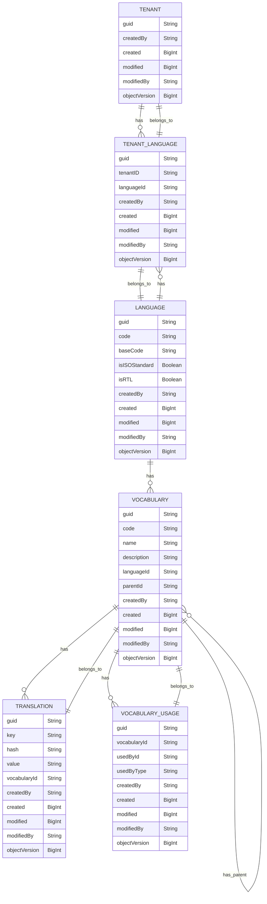

# Vocabulary Inheritance & Basic Expression System

## Executive Summary
This specification outlines the design for a system component aimed at extending the concept of internationalisation by enabling users to define specific 'vocabularies' for different languages.

The system is based around four key components: Tenants, Languages, Vocabularies, and Translations. Each tenant can create and manage their own Languages and Vocabularies. In our Languages component, we use IETF language tags, ensuring we can cater to a broad range of base languages.

Vocabularies house the specific translations for each language and are designed to support an inheritance structure. This design means we can always provide a default translation, creating a seamless experience for users. We use the Translation component to store and retrieve the key-value pairs that form our actual translations.

### Sample User Stories

#### (1) As a Platform Administrator

- **US1.1**: I want to be able to create and manage system vocabularies so that I can cater to a variety of languages and users.
    - Acceptance Criteria: 
        - I can create a new vocabulary for any ISO standard language.
        - I can modify an existing vocabulary.
        - I can delete a vocabulary.
        - I can view all vocabularies.

- **US1.2**: I want to manage system languages so that I can support multiple languages on my platform.
    - Acceptance Criteria: 
        - I can create a new system language using an ISO standard language code.
        - I can modify an existing system language.
        - I can delete a system language.
        - I can view all system languages.

- **US1.3**: As a platform administrator, I want to track changes to vocabularies and translations for auditing purposes.
    - Acceptance Criteria:
        - I can see who created or last modified a vocabulary or translation.
        - I can see when a vocabulary or translation was created or last modified.

- **US1.4**: As an platform administrator, I want to assign vocabularies to specific entities or components in my platform, so the correct vocabulary is used in the right context.
    - Acceptance Criteria: 
        - I can link a vocabulary to a specific entity (e.g., a user, component, or service).
        - I can modify the vocabulary used by an entity.
        - I can remove the link between a vocabulary and an entity.
        - I can view all entities linked to a specific vocabulary.

#### (2) As an Advisor

- **US2.1**: I want to create and manage inherited vocabularies to better cater to my specific types of users.
    - Acceptance Criteria: 
        - I can create a new vocabulary by inheriting from an existing system vocabulary.
        - I can modify my own vocabularies.
        - I can delete my own vocabularies.
        - I can view all vocabularies that I own.

- **US2.2**: I want to define custom translations for different vocabularies so I can personalize the language based on user type or experience level.
    - Acceptance Criteria: 
        - I can create a new translation for any key in my vocabulary.
        - I can modify existing translations in my vocabulary.
        - I can delete translations from my vocabulary.
        - I can view all translations within my vocabulary.

- **US2.3**: As an advisor, I want to assign different vocabularies to different user groups, so I can personalize the language based on user demographics or behaviors.
    - Acceptance Criteria: 
        - I can assign a vocabulary to a user group.
        - I can change the vocabulary assigned to a user group.
        - I can remove a vocabulary from a user group.
        - I can view the vocabularies used by different user groups.

- **US1.4**: As an advisor, I want to assign vocabularies to specific entities or components in my platform, so the correct vocabulary is used in the right context.
    - Acceptance Criteria: 
        - I can link a vocabulary to a specific entity (e.g., a user, component, or service).
        - I can modify the vocabulary used by an entity.
        - I can remove the link between a vocabulary and an entity.
        - I can view all entities linked to a specific vocabulary.

#### (3) As a Software Client

- **US3.1**: I want to retrieve a flattened vocabulary to display the correct language and translations to my users.
    - Acceptance Criteria: 
        - I can retrieve a vocabulary based on language and user type.
        - I can display the correct translations in my application.

### Examples

#### English Vocabularies

##### Professional Investors
This vocabulary includes translations for industry jargon and complex financial terms. Examples:
- Capital Gains
- Diversification
- ETFs

##### Amateur Investors
This vocabulary includes simpler, more common language, avoiding complex financial jargon. Examples:
- Money you make when you sell an investment for more than you bought it for (instead of Capital Gains)
- Spreading your investments around (instead of Diversification)

#### French Vocabularies

##### Professional Investors
This vocabulary uses French translations for financial jargon and industry-specific terms. 

##### Amateur Investors
This vocabulary includes French translations of simpler and more common financial terms, designed to be understandable by amateur investors.

 <br/>
 <br/>
 <br/>
 <br/>

## Details

The component is aimed at extending the fundamental concept of internationalisation (i18n). It is designed to enhance user experiences by providing more flexibility and customization in content localization based on their specific needs, from all aspects, system, advisor, and investor.

The foundation of this system component is the concept of 'vocabularies', unique sets of translations within specific languages. These vocabularies enable fine-grained control over the translated content provided to different types of users within the system.

The system provides base translations for all strings within the system, with the added ability for users (in this context, a 'user' refers to entities like asset managers, or 'tenants') to override these translations based on the type of user they're serving. This is achieved by creating 'inherited vocabularies' from base 'parent' vocabularies. The parent vocabulary is an ISO standard language that serves as a foundation, ensuring the system can understand the base language to use.

This component is a set of APIs for managing system vocabularies by an admin user, creating and managing inherited vocabularies by an advisor user, and retrieving a flattened vocabulary for quick lookup by a software client.

### Tokenisation

Tokenization is a key feature of internationalization and localization that allows for dynamic insertion of content into pre-defined strings. It is especially useful when the data is dynamic or dependent on other conditions or variables.

Tokenization can be used in keys and values. It enables developers to create template sentences with placeholders (tokens), which can be replaced with actual values during runtime. The use of tokens adds flexibility to the system and improves its usability.

A token is represented by a placeholder (like {0}, {1}, etc.) within a string. During runtime, these tokens are replaced with actual data. The index within the curly braces corresponds to the position of the data to be inserted in an array or list of data provided at runtime.

It is important to note the the tokens could also be the result of localisation.

__pseudo example__
```javascript
t('Hello {0}, Welcome to {1}!', 'Benjamin', t('PLATFORM_NAME'));

// output -> 'Hello Benjamin, Welcome to Duke Nukems` Robo Roller'
``````

## System Entities

In the data model, several entities are defined, such as 'Tenant', 'Language', 'Tenant_Language', 'Vocabulary', 'Translation', and 'Vocabulary_Usage'. A 'Tenant' can create languages and vocabularies, defining their relationship through the 'Tenant_Language' table. Languages not linked to a Tenant are considered system languages, which serve as the base for creating inherited vocabularies.

#### Tenant

Represents an asset manager or similar.  This already exists

Attributes:
- `guid`: Unique identifier
- `createdBy`, `created`, `modified`, `modifiedBy`, `objectVersion`: Standard audit fields

#### Language

The LANGUAGE table is central to the system, serving as the hub for different languages available within the system. It includes both base languages based on ISO standards, and custom languages defined by tenants.
It represents the definition of the base ISO language or a subset (for example, "Professional Investors" English).

Attributes:
- `guid`: Unique identifier
- `code`: Language code 
- `baseCode` : IETF language tag (BCP 47) OR ISO 639.  E.g. 'en' or 'en-GB'
- `isISOStandard`: Flag to indicate if the language is ISO standard
- `createdBy`, `created`, `modified`, `modifiedBy`, `objectVersion`: Standard audit fields

#### Tenant Language

Represents the relationship between a tenant and the languages they use.

Attributes:
- `guid`: Unique identifier
- `tenantID`: The related tenant identifier
- `languageId`: The related language identifier
- `createdBy`, `created`, `modified`, `modifiedBy`, `objectVersion`: Standard audit fields

#### Vocabulary

The vocabularies table serves as the core repository for storing all the distinct vocabularies within the system. Each record in this table represents a unique vocabulary that is linked to a specific language and can be derived from a parent vocabulary.
A vocabulary can override all or some strings from the parent vocabulary. Each vocabulary is connected to a language.

Attributes:
- `guid`: Unique identifier
- `code`: Code of the vocabulary
- `name`: Name of the vocabulary
- `description`: Description of the vocabulary
- `languageId`: The related language identifier
- `parentId`: Identifier of the parent vocabulary, if it exists
- `createdBy`, `created`, `modified`, `modifiedBy`, `objectVersion`: Standard audit fields

#### Translation

The 'Translation' table contains key-value pairs for translations, with an MD5 hash of the key field for faster client-side lookup. A 'Vocabulary' entity links to the 'Translation' through the 'Vocabulary_Usage' table, indicating the specific entity to which the vocabulary is to be applied.

Attributes:
- `guid`: Unique identifier
- `key`: Translation key
- `value`: Translation value
- `vocabularyId`: Related vocabulary identifier
- `createdBy`, `created`, `modified`, `modifiedBy`, `objectVersion`: Standard audit fields

#### Vocabulary Usage

The Vocabulary Usage table tracks where and how each vocabulary is used within the system. This is where associations between vocabularies and specific use cases or entities are made, effectively allowing different parts of your application to "speak" in the required language and vocabulary.

Attributes:
- `guid`: Unique identifier
- `vocabularyId`: Related vocabulary identifier
- `usedById`: Identifier of the entity using the vocabulary
- `usedByType`: Type of the entity using the vocabulary
- `createdBy`, `created`, `modified`, `modifiedBy`, `objectVersion`: Standard audit fields

### ERD Concept



## BE Considerations

### Internationalisation Domain
This domain extends beyond mere translation and incorporates localization, which involves adapting the system to the conventions and cultural expectations of different regions. The Internationalisation Domain seeks to meet the diverse linguistic needs of users, taking into account both regional and user-specific variations.

#### Manage Languages

- **GET /api/internationalisation/languages** 
  - Retrieve all languages. If the `Accept-Language` header is provided, return only languages relevant to the given language.
- **POST /api/internationalisation/languages** 
  - Create a new language.
- **GET /api/internationalisation/languages/{guid}** 
  - Retrieve a specific language.
- **PUT /api/internationalisation/languages/{guid}** 
  - Update a specific language.
- **DELETE /api/internationalisation/languages/{guid}** 
  - Delete a specific language.

#### Manage Vocabularies

- **GET /api/internationalisation/vocabularies** 
  - Retrieve all vocabularies.
- **POST /api/internationalisation/vocabularies** 
  - Create a new vocabulary.
- **GET /api/internationalisation/vocabularies/{guid}** 
  - Retrieve a specific vocabulary.
- **PUT /api/internationalisation/vocabularies/{guid}** 
  - Update a specific vocabulary.
- **DELETE /api/internationalisation/vocabularies/{guid}** 
  - Delete a specific vocabulary.
- **GET /api/internationalisation/vocabularies/{guid}/flattened** 
  - Retrieve a flattened version of a specific vocabulary.

`Note: On the above, I'm uncomfortable with the /flattened endpoint.  I would rather default to flattened and use the accepts header to specify the shape.  Thoughts?`

#### Manage Translations

- **GET /api/internationalisation/vocabularies/{vocab_guid}/translations** 
  - Retrieve all translations for a specific vocabulary.
- **POST /api/internationalisation/vocabularies/{vocab_guid}/translations** 
  - Add a new translation to a specific vocabulary.
- **GET /api/internationalisation/vocabularies/{vocab_guid}/translations/{guid}** 
  - Retrieve a specific translation from a specific vocabulary.
- **PUT /api/internationalisation/vocabularies/{vocab_guid}/translations/{guid}** 
  - Update a specific translation in a specific vocabulary.
- **DELETE /api/internationalisation/vocabularies/{vocab_guid}/translations/{guid}** 
  - Delete a specific translation from a specific vocabulary.

#### Manage Vocabulary Usages

- **GET /api/internationalisation/usages** 
  - Retrieve all vocabulary usages.
- **POST /api/internationalisation/usages** 
  - Create a new vocabulary usage.
- **GET /api/internationalisation/usages/{guid}** 
  - Retrieve a specific vocabulary usage.
- **PUT /api/internationalisation/usages/{guid}** 
  - Update a specific vocabulary usage.
- **DELETE /api/internationalisation/usages/{guid}** 
  - Delete a specific vocabulary usage.

### Flattening a Vocabulary
When retrieving a vocabulary via the API, the "flattening" process entails combining the selected vocabulary with its parent vocabularies. This creates a new vocabulary that contains all keys from both the selected vocabulary and its parent vocabularies, with the selected vocabulary's keys and values taking precedence over any matches from the parent vocabularies.

Flattening ensures that the final vocabulary used in translations contains all possible keys, even if they're not explicitly defined in the selected vocabulary. The process starts from the selected vocabulary and moves up through the chain of parent vocabularies to the root vocabulary, adding keys where they do not already exist.

Suppose we have three vocabularies: BaseEnglishVocabulary, ProfessionalInvestorVocabulary, and AmateurInvestorVocabulary, with ProfessionalInvestorVocabulary and AmateurInvestorVocabulary inheriting from BaseEnglishVocabulary.

When retrieving AmateurInvestorVocabulary, the API would "flatten" it by merging it with BaseEnglishVocabulary. If AmateurInvestorVocabulary defines translations for keys that also exist in BaseEnglishVocabulary, the translations from AmateurInvestorVocabulary would take precedence.

To improve performance, the API should cache the results of this flattening process. When a request is made to retrieve a vocabulary, the API first checks if a flattened version of that vocabulary exists in the cache. If it does, the API returns the cached version. If it doesn't, the API performs the flattening process, stores the result in the cache, and then returns it.

Cache invalidation should be performed when a vocabulary or any of its parent vocabularies is updated. This ensures that any changes to the vocabularies are reflected in the flattened versions. The API needs to have a mechanism in place to identify all vocabularies that inherit from a changed vocabulary, either directly or indirectly, and remove the cached flattened versions of these vocabularies. The next time a request is made to retrieve one of these vocabularies, the API will regenerate the flattened version, incorporating the changes, and cache the new result.

## Sample Usage Sequences

### User selection of vocabulary
```mermaid
sequenceDiagram
    participant UI as UI
    participant API_Client as Browser
    participant VIBES as VIBES
    UI->>API_Client: Sends user's preferred language to API Client
    API_Client->>VIBES: GET /api/internationalisation/languages (Accept-Language: User's Preferred Language)
    VIBES->>API_Client: Returns list of vocabularies matching user's preferred language
    API_Client->>UI: User selects a specific vocabulary
    UI->>API_Client: Sends selected vocabulary to API Client
    API_Client->>VIBES: GET /api/internationalisation/vocabularies/{guid} 
    VIBES-->>VIBES: Saves user's selected vocabulary for future use
    VIBES->>API_Client: Returns flattened vocabulary data
    API_Client->>UI: Updates UI with selected vocabulary
``````

## System selection of vocabulary
```mermaid
sequenceDiagram
    participant UI as UI
    participant API_Client as Browser
    participant VIBES as VIBES
    UI->>API_Client: Sends user's preferred language to API Client
    API_Client->>VIBES: GET /api/internationalisation/vocabularies (Accept-Language: User's Preferred Language)
    VIBES->>VIBES: Determine Vocabulary based on Risk Profile and Language Preference
    VIBES->>API_Client: Returns flattened vocabulary matching user's preferred language and usage type
    API_Client->>UI: Updates UI with selected vocabulary
```

## FE Considerations

### Vocabulary Provider

#### 1. State Initialization

The provider initializes states for storing the available languages, the vocabularies corresponding to those languages, and the currently selected language. The selected language is initially set to the browser's default language.

#### 2. Fetching Languages and Vocabularies

On mount, the provider makes an API call to fetch the list of available languages and their corresponding vocabularies. The response data is used to update the languages and vocabularies states.

#### 3. Language Selection

The provider exposes a function for updating the selected language. When a user selects a new language, this function updates the selected language state, and triggers another API call to fetch the appropriate vocabulary.

#### 4. Translation Function (t)

The provider also exposes a translate function (`t`) for the rest of the application to use. This function takes a key as an argument and returns the corresponding translated string from the currently selected vocabulary. If the key doesn't exist in the vocabulary, it logs a warning to the console and returns the key itself.

#### 5. Debugging

To assist with debugging, the translate function logs to the console whenever it's called with a key that doesn't exist in the current vocabulary if the debugging property is set to true

#### 6. Context Exposing

Finally, the provider uses a React Context to expose the list of available languages, the selected language, the vocabularies, and the translate function to the rest of the application. Other components can then use the `useContext` hook to access these values and functions.

An example of such a provider is as follows:
```tsx
import {
  BasicI18NStrategy,
  formatString,
  I18NArguments,
  I18NStrategy,
  Primitive,
  Vocabulary,
  VocabularyDefinition,
} from 'js-core';
import { createContext, ReactNode, useEffect, useRef, useState } from 'react';
import { Loader } from '../../progress';
import { LocalizationProvider as DatePickerLocalisationProvider } from '@mui/x-date-pickers';
import { AdapterMoment } from '@mui/x-date-pickers/AdapterMoment';

export const LocalizationContext = createContext<I18NStrategy>({
  t(...params: I18NArguments): string {
    const [text, ...rest] = params;
    if (!text) {
      return text;
    }
    return formatString(text, ...(rest as Primitive[]));
  },
  setVocabulary: () => {
    // No Default Action
  },
  isRTL: () => false,
  onInvalidTranslation: () => {
    // No Default Action
  },
  loadVocabularies: () => [] as Vocabulary[],
});

export type LocalizationProviderProps = {
  localizationStrategy?: I18NStrategy;
  children: ReactNode;
};

export function LocalizationProvider({
  children,
  localizationStrategy,
}: LocalizationProviderProps) {
  const strategy = useRef<I18NStrategy>(new BasicI18NStrategy());

  useEffect(() => {
    if (localizationStrategy) {
      strategy.current = localizationStrategy;
    } else {
      strategy.current = new BasicI18NStrategy();
    }
  }, [localizationStrategy]);

  const [availableVocabularies, setAvailableVocabularies] = useState<
    Vocabulary[] | null
  >(null);

  useEffect(() => {
    if (!availableVocabularies) {
      setAvailableVocabularies(strategy.current.loadVocabularies());
    }
    // eslint-disable-next-line react-hooks/exhaustive-deps
  }, []);

  return (
    <LocalizationContext.Provider
      value={{
        t: (...params: I18NArguments) => strategy.current.t(...params),
        setVocabulary: (
          name: string,
          vocabularyDefinition: VocabularyDefinition,
        ) => strategy.current.setVocabulary(name, vocabularyDefinition),
        isRTL: () => strategy.current.isRTL(),
        onInvalidTranslation: (text: string, vocabulary: string) =>
          strategy.current.onInvalidTranslation(text, vocabulary),
        loadVocabularies: () => strategy.current.loadVocabularies(),
      }}
    >
      <DatePickerLocalisationProvider dateAdapter={AdapterMoment}>
        {!availableVocabularies && <Loader />}
        {availableVocabularies && children}
      </DatePickerLocalisationProvider>
    </LocalizationContext.Provider>
  );
}

export default LocalizationProvider;

```

### Types

#### I18NArguments
The following type will make it easier to defined the arguments and parameters that are passed using the Vocabularies.  Errors from the API could also be provided in this format which would make it easy to translate text from the BE through the same mechanism.

```typescript
export type I18NArguments = [
  text: string,
  ...params: (Primitive | undefined)[],
];
```

#### t Function
The t function is used to translate text throughout all of the FE.  All strings when rendered should be passed through the t function.

An example of a t function interface would be as follows:
```typescript
export type I18NStrategy = {
  /**
   * The translation function
   */
  t: (...params: I18NArguments) => string;

  setVocabulary: (
    name: string,
    vocabularyDefinition: VocabularyDefinition,
  ) => void;
  isRTL: () => boolean;
  onInvalidTranslation: (text: string, vocabulary: string) => void;
  loadVocabularies: () => Vocabulary[];
};
```

This would allow multiple strategies to be applied.  

An example of a Basic Strategy would be as follows:
```typescript
import { formatString } from '../formatters';
import { Primitive } from '../types';
import { isRTL } from './languages';
import { I18NArguments, I18NStrategy, VocabularyDefinition } from './types';

export class BasicI18NStrategy implements I18NStrategy {
  private selectedVocabulary: VocabularyDefinition | null = null;

  t(...params: I18NArguments): string {
    const [text, ...rest] = params;
    if (!text) {
      return text;
    }
    const translatedText = this.selectedVocabulary
      ? this.selectedVocabulary.values[text.toLocaleLowerCase()]
      : undefined;
    if (!translatedText) {
      this.onInvalidTranslation(text, this.selectedVocabulary?.name);
    }
    return formatString(translatedText || text, ...(rest as Primitive[]));
  }

  // eslint-disable-next-line @typescript-eslint/no-unused-vars
  onInvalidTranslation(text: string, vocabulary: string | undefined) {
    // Do nothing by default
  }

  setVocabulary(name: string, vocabularyDefinition: VocabularyDefinition) {
    this.selectedVocabulary = vocabularyDefinition;
  }

  loadVocabularies() {
    return [];
  }

  isRTL() {
    if (this.selectedVocabulary) {
      return isRTL(this.selectedVocabulary.language);
    } else {
      return false;
    }
  }
}

```

Where the `formatString` function to replace the tokens looks something like the following:

```typescript
export function formatString(str: string, ...parameters: Primitive[]) {
  return str.replace(/\\?{(\d+)}/g, (match: string, number: number) => {
    if (match.startsWith('\\')) {
      return match.substring(1);
    }
    return parameters[number] !== undefined && parameters[number] !== null
      ? parameters[number].toString()
      : '';
  });
}
```